- [**Model TCP/IP**](#model-tcpip)
  - [**Internet Protocol (IP)**](#internet-protocol-ip)
    - [**IP adresa**](#ip-adresa)
    - [**Internet Protocol verze 4 (IPv4)**](#internet-protocol-verze-4-ipv4)
      - [**Formát IPv4 adres**](#formát-ipv4-adres)
      - [**Směrování IPv4 adres**](#směrování-ipv4-adres)
    - [**Internet Protocol verze 6 (IPv6)**](#internet-protocol-verze-6-ipv6)
      - [**Formát IPv6 adres**](#formát-ipv6-adres)
      - [**Směrování IPv6 adres**](#směrování-ipv6-adres)
      - [**Přenos dat na linkové vrstvě**](#přenos-dat-na-linkové-vrstvě)
- [AutomatedLab](#automatedlab)
- [Úkoly](#úkoly)
  - [**Lektorské úkoly**](#lektorské-úkoly)
  - [**Lab L00 -- konfigurace virtuálních stanic**](#lab-l00----konfigurace-virtuálních-stanic)
    - [**Lab L01 -- Možnosti konfigurace IPv4 a IPv6**](#lab-l01----možnosti-konfigurace-ipv4-a-ipv6)
    - [**Lab L02 -- Příprava základní topologie sítě**](#lab-l02----příprava-základní-topologie-sítě)
    - [**Lab L03 -- Wireshark** \[^8\]](#lab-l03----wireshark-8)
    - [**Lab L04 -- Zavedení IPv6 ve vytvořené síti**](#lab-l04----zavedení-ipv6-ve-vytvořené-síti)
  - [**Studentské úkoly**](#studentské-úkoly)


# **Model TCP/IP**

**TCP/IP model**, často také označovaný jako **Internetový model**, je
zjednodušením ISO/OSI modelu. Nevýhodou ISO/OSI modelu je jeho přílišná
složitost. ISO/OSI model tvoří 7 vrstev, jak je vidět na obrázku 1,
některé vrstvy ovšem nikdy nebyly plně implementovány. Implementovat
každou vrstvu jako samostatný celek se brzy ukázalo jako příliš náročné,
často tedy implementace jedné vrstvy zajišťovala také funkcionalitu
vrstev dalších. **TCP/IP model** se skládá pouze ze 4 vrstev, kdy
některé vrstvy ISO/OSI modelu jsou sloučeny do jediné. **TCP/IP model**
je zobrazen na obrázku 1, z něhož je také patrné mapování vrstev ISO/OSI
modelu na vrstvy **TCP/IP modelu**. Hlavní zjednodušení spočívá
v integraci *presentační* a *relační* vrstvy ISO/OSI modelu do
*aplikační* vrstvy, *linková* a *fyzická* vrstva ISO/OSI modelu je u
**TCP/IP modelu** nahrazena jedinou *vrstvou fyzického rozhraní*.

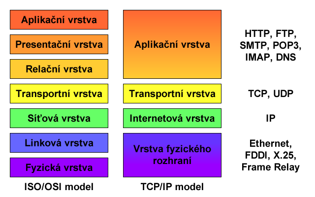

Obrázek 1. Porovnání ISO/OSI a TCP/IP modelu s protokoly jednotlivých
vrstev

Pochopení **TCP/IP modelu** je důležité pro správnou konfiguraci sítě či
analýzu a řešení problémů při komunikaci mezi počítači nebo aplikacemi.
Každá vrstva tohoto modelu poskytuje a zajišťuje jiné služby:

-   **Aplikační vrstva** zajišťuje komunikaci na nejvyšší úrovni, tedy
    komunikaci mezi samotnými procesy a aplikacemi, které běží na
    počítači. Tato vrstva také řeší reprezentaci dat (vhodné kódování
    aplikačních dat pro přenos, převod dat do tohoto kódování a zpět) a
    řízení dialogu (vytváření a udržování relací, tzv. *sessions*, které
    vyjadřují kontext komunikace).

-   **Transportní vrstva** vytváří logické spojení mezi koncovými
    body [^1]. Transportní protokoly rozdělují aplikační data na menší
    jednotky, tzv. *pakety*, jenž jsou poté posílány po síti. Mezi
    základní protokoly transportní vrstvy patří:

    -   **TCP** (*Transmission Control Protocol*) pro spolehlivý přenos
        dat. Tento protokol zasílá aplikační data jako proud dat, který
        je tvořen z číslovaných paketů. Protokol zajišťuje správné
        pořadí zasílaných paketů [^2], potvrzování přijetí paketů druhou
        stranou a také řízení toku a zahlcení. Než se mohou data
        posílat, je potřeba ustanovit spojení mezi koncovými uzly.

    -   **UDP** (*User Datagram Protocol*) pro nespolehlivý přenos dat.
        Tento protokol slouží k rychlému přenosu dat, ovšem bez zaručení
        spolehlivého doručení. Pakety nejsou očíslovány a jsou zasílány
        samostatně, cílový koncový uzel tedy nemá jak zjistit, zda se
        některé pakety po cestě ztratily či nikoliv. V případě potřeby
        doručování paketů ve správném pořadí nebo zajištění spolehlivého
        doručení musí tuto funkcionalitu zajistit sám zdrojový koncový
        uzel (např. dodatečnou implementací na vyšší úrovni).

-   **Internetová vrstva** vytváří logické spojení mezi počítači.
    Protokoly internetové vrstvy směrují zaobalené pakety, tzv.
    *datagramy*, na místo určení na základě cílové adresy. Internetová
    vrstva se snaží doručit data nejvhodnější cestou, tzv. doručení s
    největším úsilím (*best-effort delivery*). Pokud dojde při přenosu
    ke ztrátě dat, je o tom odesilatel informován a musí sám zajistit
    opětovné přenesení dat.

-   **Vrstva fyzického rozhraní** popisuje standardy pro fyzické médium
    a elektrické signály. Tato vrstva definuje funkce pro přístup k
    fyzickému médiu a zajišťuje zabalování *datagramů* do tzv. *rámců*.

Implementace **TCP/IP modelu** je rozdělena do tří částí. Nejnižší část,
*vrstva fyzického rozhraní*, je implementována v síťové kartě a jejím
ovladači. Vyšší vrstvy, *internetová* a *transportní*, jsou součástí
síťových modulů operačních systémů (*TCP/IP stack*), které bývají
implicitně nainstalovány. Poslední vrstva, *aplikační*, je
implementována buď přímo v aplikacích (webový prohlížeč) nebo jako
systémové služby (např. DNS klient).

## **Internet Protocol (IP)**

Jeden z nejdůležitějších protokolů z hlediska správy sítí. IP je
protokol *internetové* vrstvy a zajišťuje směrování *datagramů* v síti.
Existují celkem dvě verze toho protokolu, starší, ale značně rozšířený,
IPv4 a novější IPv6. Jelikož operační systémy Windows podporují obě tyto
verze protokolu a řada nových služeb či aplikací systému je přímo
závislá na IPv6, je potřeba znát obě tyto verze, jenž jsou velice
odlišné.

### **IP adresa**

**IP adresa** slouží k jednoznačné identifikaci síťového rozhraní
(konkrétního zařízení) v rámci dané (pod)sítě. Každý *datagram* obsahuje
adresy zdrojového a cílového koncového uzlu a internetová vrstva se
snaží doručit *datagram* od zdroje k cíli.

### **Internet Protocol verze 4 (IPv4)**

Starší, ale nesmírně rozšířená, verze IP protokolu. Většina stávajících
interních sítí a podstatná část sítě internet stále používá **IPv4**
jako komunikační protokol *internetové* vrstvy. Je proto důležité umět
pracovat s touto verzí IP protokolu.

#### **Formát IPv4 adres**

**IPv4 adresy** jsou 32bitová čísla, jenž se zapisují v dekadickém
formátu s tečkovou notací po osmi bitech. Tedy každá adresa je ve
formátu X.X.X.X, kde X je číslo od 0 do 255. Z hlediska struktury se
dělí **IPv4 adresa** na tři základní části, jak je zobrazeno na obrázku
2.

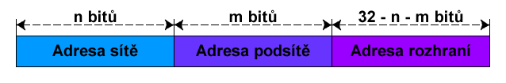

Obrázek 2. Struktura IPv4 adresy

Dříve byla **IPv4 adresa** tvořena pouze adresami sítě a rozhraní, toto
členění ovšem bylo příliš hrubé a docházelo tak k zbytečnému plýtvání
adres, jelikož adresa sítě byla tvořena vždy pouze prvními osmi bity a
zbylé adresy rozhraní, kterých bylo 16 miliónů pro každou síť, byly
využity jen minimálně. Proto se později **IPv4 adresy** rozdělily do
tříd, které se odlišovaly velikostí části, jenž byla vyhrazena pro
adresu sítě, tak se vytvořilo podstatně více sítí pro méně rozhraní.
Nakonec se i toto rozdělení ukázalo jako nevhodné a adresa rozhraní se
rozdělila na část adresy podsítě a rozhraní, což umožnilo ještě jemnější
rozdělování rozhraní do sítí. Adresu sítě pro danou koncovou síť
přiděluje vždy poskytovatel připojení (přesněji lokální registrátor).
Jak bude rozdělena lokální část adresy, tedy jaká část bude vyhrazena
pro adresy podsítí a jaká část pro adresy rozhraní, určuje již správce
dotyčné koncové sítě.

Pro určení hranice mezi adresami podsítě a rozhraní se využívá tzv.
**masky podsítě** (*subnet mask*). Stejně jako v případě **IPv4
adresy**, i **maska podsítě** je 32bitové číslo zapsané ve stejném
formátu jako **IPv4 adresa**. V binárním tvaru obsahuje jedničky tam,
kde se v **IPv4 adrese** nachází adresa sítě a podsítě a nuly tam, kde
je adresa rozhraní. Jelikož část obsahující adresu podsítě může být
různě velká, musí být součástí konfigurace síťového rozhraní vždy i
**maska podsítě**.

| Třída | Prefix sítě | 1\. bajt  | Maska                            | Bitů sítě | Bitů počítače | Počet sítí | Počet stanic v síti |
| ----- | ----------- | --------- | -------------------------------- | --------- | ------------- | ---------- | ------------------- |
| A     | 0           | 0 - 127   | 255.0.0.0                        | 7         | 24            | 126        | 16 777 214          |
| B     | 10          | 128 - 191 | 255.255.0.0                      | 14        | 16            | 16 384     | 65 534              |
| C     | 110         | 192 - 223 | 255.255.255.0                    | 21        | 8             | 2 097 152  | 254                 |
| D     | 1110        | 224 - 239 | Skupinové vysílání (*multicast*) |           |               |            |                     |
| E     | 1111        | 240 - 255 | Rezervováno pro pozdější využití |           |               |            |                     |

Tabulka 1. Třídy IPv4 adres

Tabulka 1 výše zachycuje rozdělení **IPv4 adres** do jednotlivých tříd s
informacemi o tom, jak velká část **IPv4 adresy** je vyhrazena pro
identifikaci sítě a jak velká část pro identifikaci rozhraní. Z části
vyhrazené pro adresu rozhraní lze ještě, v případě potřeby, ubrat pár
bitů pro identifikaci podsítě, jak bylo zmíněno dříve. Dnes se již
rozdělení do tříd nevyužívá, jelikož bylo nahrazeno rozdělením podle
CIDR, které je flexibilnější a bude zmíněno v dalším textu.

#### **Směrování IPv4 adres**

Směrování slouží k dopravě *datagramů* ze zdrojového koncového uzlu do
cílového koncového uzlu (tedy nejčastěji k přenosu dat mezi dvěma
počítači). Směrování se provádí na základě směrovacích tabulek, jenž
mohou být nastaveny staticky uživatelem nebo dynamicky pomocí
směrovacích protokolů jako RIP (*Routing Information Protocol*) nebo
OSPF (*Open Shortest Path First*).

Směrovací tabulky obsahují informace o tom, kterými porty směrovače nebo
skrz které síťové rozhraní počítače se dá dostat do sítě, ve které leží
koncový uzel s cílovou adresou. V dnešní době se pro směrování používá
hlavně tzv. **beztřídní mezidoménové směrování** (CIDR, *Classless
Inter-Domain Routing*), jenž umožňuje explicitně specifikovat předěl
mezi částí s adresou sítě a částí s adresou počítače. Adresy se v tomto
případě zapisují ve formátu X.X.X.X/Y, kde první část je **IPv4 adresa**
a Y je počet bitů adresy sítě.

Pokud směrovači[^3] přijde *datagram*, podívá se do směrovací tabulky a
zjistí, skrz které porty se dá dostat do sítě, do které náleží cílová
**IPv4 adresa** v *datagramu*. Pokud je jich více, některý vybere na
základě dalších informací (např. podle nastavené metriky, podle zahlcení
dané cesty apod.). V případě, že *datagram* přišel na port, jenž vede do
sítě, kam tento *datagram* směřuje, dojde k jeho zahození. Druhá
situace, kdy může dojít k cílenému zahození *datagramu*, je v případě,
že směrovač odděluje interní síť od sítě internet a cílová adresa v
*datagramu* náleží do privátní sítě. Takovéto *datagramy* jsou
**nesměrovatelné** v síti internet. Seznam privátních sítí lze nalézt v
tabulce 2 níže. Posledním případem je situace, kdy cílová adresa je
adresa pro všesměrové vysílání (*broadcast*) a ostatní porty směřují do
jiných podsítí, takového *datagramy* nikdy **nesmí** překročit hranice
podsítě.

| CIDR adresový blok | Popis                                             |
| ------------------ | ------------------------------------------------- |
| 0.0.0.0/8          | Aktuální síť (pouze pro zdrojové adresy)          |
| 10.0.0.0/8         | Privátní síť                                      |
| 127.0.0.0/8        | Loopback                                          |
| 169.254.0.0/16     | Privátní síť (**APIPA**)                          |
| 172.16.0.0/12      | Privátní síť                                      |
| 192.88.99.0/24     | IPv6 to IPv4 překlad                              |
| 192.168.0.0/16     | Privátní síť                                      |
| 224.0.0.0/4        | Multicast (skupinové vysílání, předchozí třída D) |
| 240.0.0.0/4        | Rezervováno (předchozí třída E)                   |
| 255.255.255.255    | Broadcast (všesměrové vysílání)                   |

Tabulka 2. Seznam speciálních rozsahů IPv4 adres

### **Internet Protocol verze 6 (IPv6)**

Protokol **IPv6** vznikl jako reakce na blížící se úplné vyčerpání IPv4
adres. I když se zatím rozšiřuje tato verze jen velice pozvolna, její
využití, hlavně v interních sítích, roste. Mluví pro to i fakt, že velká
řada nových služeb a aplikací v posledních verzích systému Windows je
přímo závislá na **IPv6**, tedy nelze je provozovat na IPv4. Dobrá
znalost této verze protokolu bude tedy stále důležitější.

#### **Formát IPv6 adres**

**IPv6 adresy** jsou značně odlišné od IPv4 adres. Jsou to 128bitová
čísla, která se standardně zapisují v hexadecimálním formátu s
dvojtečkovou notací po skupinách 16 bitů. Tedy každá adresa je ve
formátu X:X:X:X:X:X:X:X, kde X je hexadecimální číslo od 0000 do FFFF.
Často se ovšem zapisují ve zkrácených formátech, kdy se vynechávají
úvodní nuly jednotlivých skupin nebo se slučují nulové skupiny a místo
nich se píše pouze :: (toto nahrazení se může ovšem použít jen jednou v
rámci jedné adresy). Různé formy zápisu **IPv6 adres** shrnuje tabulka 3
níže.

<table>
<colgroup>
<col style="width: 48%" />
<col style="width: 51%" />
</colgroup>
<thead>
<tr class="header">
<th>IPv6 adresa</th>
<th>Popis</th>
</tr>
</thead>
<tbody>
<tr class="odd">
<td>fec0:0000:0000:000a:f563:5add:6fc4:152e</td>
<td>Standardní formát</td>
</tr>
<tr class="even">
<td>fec0:0:0:a:f563:5add:6fc4:152e</td>
<td>S vynecháním úvodních nul každé skupiny</td>
</tr>
<tr class="odd">
<td>fec0::a:f563:5add:6fc4:152e</td>
<td><p>S vynecháním úvodních nul každé skupiny</p>
<p>a sloučením po sobě jdoucích nulových skupin</p></td>
</tr>
</tbody>
</table>

Tabulka 3. Různé formáty IPv6 adres

Z hlediska struktury záleží na konkrétním typu **IPv6 adresy**. Adresní
architektura IPv6 rozlišuje tři typy IPv6 adres:

-   **Individuální** (*unicast*) adresy identifikující právě jedno
    síťové rozhraní. IPv6 protokol rozlišuje celkem tři typy
    individuálních adres: *globální*, *místní* a *místní v rámci
    propojení*.

-   **Skupinové** (*multicast*) adresy identifikující celou skupinu
    síťových rozhraní. Data zaslaná na skupinovou IPv6 adresu se
    doručují všem členům skupiny.

-   **Výběrové** (*anycast*) adresy identifikující celou skupinu
    síťových rozhraní. Data zaslaná na výběrovou IPv6 adresu se doručují
    nejbližšímu členovi skupiny.

Na rozdíl od IPv4 zde chybí typ adres pro všesměrové vysílání
(*broadcast*), tyto adresy jsou u IPv6 nahrazeny speciálním typem
skupinových adres.

**Globální individuální** (*global unicast*) adresy jednoznačně
identifikují dané síťové rozhraní v rámci celé sítě internet. Struktura
je podobná jako u IPv4 adres a je zobrazena na obrázku 3. IPv6 adresní
architektura ovšem vyžaduje, aby všechny globální individuální adresy,
jenž nezačínají prefixem 000, obsahovaly adresu rozhraní o délce 64bitů.
Navíc tato adresa musí být vytvořena v modifikovaném EUI-64 formátu,
jenž se získává z fyzické (MAC, *Media Access Control*) adresy rozhraní
invertováním předposledního bitu nejvyššího bytu a vložením FF:FE mezi
třetí a čtvrtý bajt MAC adresy. Ilustrace tohoto procesu je zobrazena na
obrázku 4 a struktura globální individuální **IPv6 adresy** na obrázku
5.

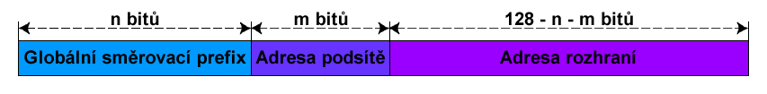

Obrázek 3. Obecný formát globálních individuálních IPv6 adres

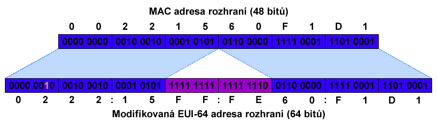

Obrázek 4. Vytvoření modifikované EUI-64 adresy z MAC adresy

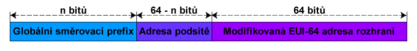

Obrázek 5. Formát globálních individuálních IPv6 adres nezačínajících
prefixem 000

Jelikož se aktuálně používá pouze globální směrovací prefix 001 (ostatní
tříbitové prefixy, kromě 000, jsou vyhrazeny pro pozdější využití),
vypadá v praxi formát globálních individuálních adres tak, jak je
znázorněno na obrázku 6. Globální individuální IPv6 adresy tedy náleží
do sítě **2000::/3**.

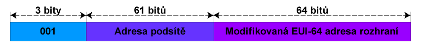

Obrázek 6. Aktuální formát globálních individuálních IPv6 adres

**Místní v rámci propojení**  (*link-local unicast*) adresy stejně jako
globální individuální adresy jednoznačně identifikují dané síťové
rozhraní, ale pouze v rámci jediného spoje (jednoho propojení[^4], např.
ethernetu). Používají se hlavně při automatické konfiguraci IPv6 adres.
Směrovače **nesmí** předávat *datagramy* se zdrojovou či cílovou místní
adresou v rámci propojení. Struktura místní adresy v rámci propojení je
zobrazena na obrázku 7. Místní IPv6 adresy v rámci propojení náleží do
sítě **fe80::/10**.

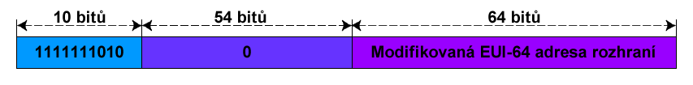

Obrázek 7. Formát místních IPv6 adres v rámci propojení

**Místní** (*unique local*) adresy opět jednoznačně identifikují
konkrétní síťové rozhraní, tentokrát ale v rámci celé lokální sítě. Tyto
adresy nahradily tzv. *site-local unicast* adresy, jenž se používaly
dříve ke stejnému účelu, ale jejich použití se ukázalo jako
problematické. Struktura místní adresy je zobrazena na obrázku 8. U
místních adres nelze provést jejich automatickou konfiguraci jako je
tomu u místních adres v rámci propojení, jelikož některé informace
(globální identifikátor a adresa podsítě) nejsou známy. Tyto informace
musí poskytnout buď DHCPv6 server nebo častěji přímo směrovač pomocí
tzv. *router advertisement*. Router advertisement je forma bezstavové
konfigurace, kdy směrovač namísto celé IP adresy posílá zařízením jen
globální identifikátor a adresu podsítě[^5] a neuchovává si informace o
tom, kdo má kterou IP adresu přiřazenu (stav). Hodnota **L** bitu říká,
jakou metodou byl vygenerován globální identifikátor. Aktuálně se
používá jen jedna metoda, tzv. lokální metoda, jenž je definována ve
specifikaci místních IPv6 adres. Při použití této metody se **L** bit
nastavuje na hodnotu 1. Místní IPv6 adresy náleží do sítě **fc00::/7**,
ovšem jelikož **L** bit je prakticky vždy nastaven na hodnotu 1, lze
narazit také na rozsah **fd00::/8**.

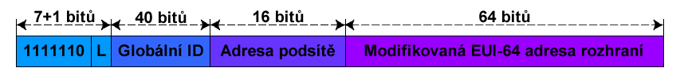

Obrázek 8. Formát místní IPv6 adresy

**Skupinové** (*multicast*) adresy identifikují celou skupinu síťových
rozhraní, na rozdíl od skupinových adres u IPv4 lze ale u IPv6 přímo
ovlivňovat jejich dosah. Struktura skupinové **IPv6 adresy** je vidět na
obrázku 9. Hodnota části dosah omezuje šíření skupinově adresovaných
dat, definované hodnoty jednotlivých dosahů a jejich význam jsou shrnuty
v tabulce 4, ostatní hodnoty jsou buď nedefinované, nebo rezervované.

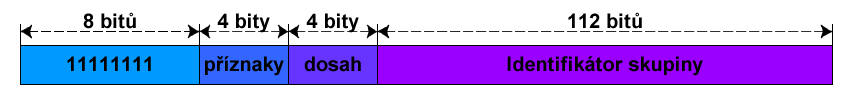

Obrázek 9. Formát skupinových IPv6 adres

| Hodnota | Význam                                         |
| ------- | ---------------------------------------------- |
| 1       | Rozhraní (*interface-local*)                   |
| 2       | Propojení, síť linkové vrstvy (*link-local*)   |
| 4       | Administrativně definovaná síť (*admin-local*) |
| 5       | Místo, lokální síť (*site-local*)              |
| 8       | Organizace (*organization-local*)              |
| E       | Globální (*global*)                            |

Tabulka 4. Definované hodnoty rozsahu u skupinových adres

**Výběrové** (*anycast*) adresy jsou podobné individuálním adresám,
označují ovšem celou skupinu síťových rozhraní a *datagram* zaslaný na
takovouto adresu je doručen na nejbližší rozhraní na základě metriky
daného směrovacího protokolu. Struktura výběrové **IPv6 adresy** je
zachycena na obrázku 10. Adresa je zcela určena jen částí obsahující
prefix podsítě[^6]. Tato část určuje konkrétní propojení (*link*), tedy
podsíť, jenž obsahuje rozhraní (směrovače) se stejnou výběrovou adresou.
*Datagram* zaslaný na výběrovou **IPv6 adresu** je doručen některému
(nejbližšímu) rozhraní, které se nachází v dané podsíti.

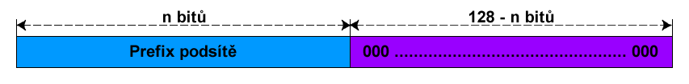

Obrázek 10. Formát výběrových IPv6 adres

**Všesměrové** (*broadcast*) adresy jsou u IPv6 nahrazeny
předdefinovanými skupinovými adresami. Každé síťové rozhraní je na
základě svého umístění (v počítači, směrovači apod.) implicitně členem
některých z předdefinovaných skupin, přijímá tak všechny *datagramy*
směřující do těchto skupin. Díky možnosti explicitní specifikace dosahu
u skupinových adres lze také šířit všesměrové zasílání dat i přes
hranice směrovačů, což u IPv4 nebylo možné. Tabulka 5 zahrnuje
předdefinované skupinové adresy s informacemi o jejich dosahu a použití.
Je vidět, že všesměrové vysílání známé z IPv4 je u IPv6 ekvivalentní
zasílání dat na skupinovou adresu FF02::1.

| Adresa            | Dosah     | Použití                                  |
| ----------------- | --------- | ---------------------------------------- |
| FF00::0 - FF0F::0 | \-        | Rezervované adresy (nesmí se přidělovat) |
| FF01::1           | Rozhraní  | Všechny uzly                             |
| FF01::2           | Rozhraní  | Všechny směrovače                        |
| FF02::1           | Propojení | Všechny uzly                             |
| FF02::2           | Propojení | Všechny směrovače                        |
| FF02::9           | Propojení | Všechny RIP směrovače                    |
| FF02::1:FFxx:xxxx | Propojení | Adresy vyžádané uzlem                    |
| FF05::2           | Místo     | Všechny směrovače                        |
| FF05::101         | Místo     | Všechny NNTP servery                     |

Tabulka 5. Seznam předdefinovaných skupinových adres

#### **Směrování IPv6 adres**

Směrování u IPv6 je prakticky totožné se směrováním u IPv4. Opět se
využívá CIDR, pouze adresy jsou větší. Ve směrovacích tabulkách se
ukládají pro každou (pod)síť informace o jejích prefixu a délce tohoto
prefixu. Obecně je ovšem směrování u IPv6 podstatně náročnější, hlavně
kvůli skupinovým adresám, u kterých musí směrovače řešit správné
přeposílání podle nastaveného dosahu. Naopak se zase nemusí řešit
problémy se směrováním privátních IP adres, protože ty u IPv6
neexistují.

#### **Přenos dat na linkové vrstvě**

Při přenosu dat na *linkové* vrstvě (*vrstvě fyzického rozhraní*)
nedochází k žádnému směrování. Data jsou zde reprezentována rámci
(*frames*) a pro identifikaci zdrojových a cílových koncových uzlů se
používá fyzická adresa. Fyzická (MAC, *Media Access Control*) adresa je
48bitové číslo, jenž se zapisuje v hexadecimální formátu s pomlčkovou
notací po osmi bitech. Tedy každá adresa je ve formátu X-X-X-X-X-X, kde
X je hexadecimální číslo od 00 do FF.

Samotný přenos dat se dá přirovnat k všesměrovému vysílání. Data jsou v
rámci dané linky zaslána všem uzlů, každé rozhraní připojené na danou
linku přijme tyto data a porovná svou MAC adresu s MAC adresou cílového
koncového uzlu obsaženou v přijatém rámci, pokud se tyto adresy shodují,
jsou data předána vyšší vrstvě, jinak jsou data zahozena. Výjimkou je
případ, kdy cílová MAC adresa koncového uzlu je FF-FF-FF-FF-FF-FF, v
tomto případě každé rozhraní posílaná data přijme, tedy tato adresa
slouží pro všesměrové vysílání na *linkové* vrstvě. Jedno rozhraní může
mít více než jednu MAC adresu, ovšem **pouze jedna** může být
*individuální*, ostatní jsou pak vždy *skupinové*. Skupinové MAC adresy
se vytvářejí automaticky na základě IP adres. V případě IPv4 se připojí
k prefixu MAC adresy 01-00-5E nižších 23 bitů z 28 bitů, jenž
identifikují skupinu u skupinové IPv4 adresy, tedy skupinové MAC adresy
pro IPv4 jsou vždy v rozsahu 01-00-5E-00-00-00 až 01-00-5E-7F-FF-FF.
Příklad převodu IPv4 skupinové adresy na odpovídající skupinovou MAC
adresu je vidět na obrázku 9. V případě IPv6 se připojí k prefixu MAC
adresy 33-33 posledních 32 bitů IPv6 skupinové adresy, tedy skupinové
MAC pro IPv6 jsou v rozsahu 33-33-00-00-00-00 až 33-33-FF-FF-FF-FF. Je
zřejmé, že v případě obou verzí IP, je počet skupinových IP adres větší
než počet skupinových MAC adres, každá skupinová MAC adresa je tedy
sdílena více skupinovými IP adresami při přenosech na *linkové* vrstvě.
Tento problém se řeší jednoduše až na *síťové* (*internetové*) vrstvě
ověřením skupinové IP adresy.

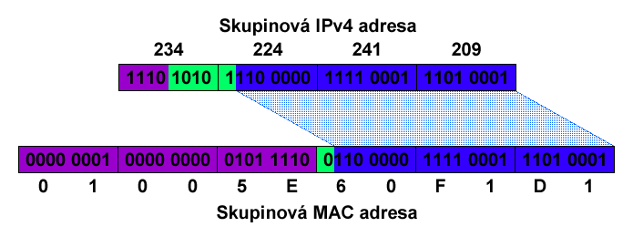

Obrázek 11. Převod Skupinové IPv4 adresy na odpovídající skupinovou MAC
adresu

V případě všesměrové IP adresy je odpovídající MAC adresa známa, MAC
adresy pro skupinové IP adresy lze získat převody zmíněnými výše,
ostatní (individuální) IP adresy mohou odpovídat obecně jakékoliv MAC
adrese. K zajištění překladu IP adres na MAC adresy se používají
protokoly ARP (*Address Resolution Protocol*) u IPv4 a NDP (*Neighbor
Discovery Protocol*) u IPv6, jenž udržují v paměti překladové tabulky
mapující IP adresy na odpovídající MAC adresy. Záznamy v těchto
tabulkách mají omezenou dobu platnosti a jsou periodicky mazány.

---

# AutomatedLab

```pwsh
$labName = 'E01'

New-LabDefinition -Name $labName -DefaultVirtualizationEngine HyperV
Set-LabInstallationCredential -Username root -Password root4lab

Add-LabVirtualNetworkDefinition -Name none

Add-LabVirtualNetworkDefinition -Name Private1 
Add-LabVirtualNetworkDefinition -Name Private2
Add-LabVirtualNetworkDefinition -Name Private3
Add-LabVirtualNetworkDefinition -Name Private4

$w11_network = @(
    New-LabNetworkAdapterDefinition -UseDhcp -InterfaceName LAN1 -VirtualSwitch none
    New-LabNetworkAdapterDefinition -UseDhcp -InterfaceName LAN2 -VirtualSwitch Private1 
    New-LabNetworkAdapterDefinition -UseDhcp -InterfaceName LAN3 -VirtualSwitch none 
    New-LabNetworkAdapterDefinition -UseDhcp -InterfaceName LAN4 -VirtualSwitch none 
)

Add-LabMachineDefinition -Name w11   -Memory 2GB -NetworkAdapter $w11_network -OperatingSystem 'Windows 11 Pro'

$w2022_network = @(
    New-LabNetworkAdapterDefinition -UseDhcp -InterfaceName LAN1 -VirtualSwitch none
    New-LabNetworkAdapterDefinition -UseDhcp -InterfaceName LAN2 -VirtualSwitch Private4 
    New-LabNetworkAdapterDefinition -UseDhcp -InterfaceName LAN3 -VirtualSwitch none 
    New-LabNetworkAdapterDefinition -UseDhcp -InterfaceName LAN4 -VirtualSwitch none 
)

Add-LabMachineDefinition -Name w2022 -Memory 2GB -NetworkAdapter $w2022_network -OperatingSystem 'Windows Server 2022 Datacenter Evaluation (Desktop Experience)'

Install-Lab 

Show-LabDeploymentSummary -Detailed
```

# Úkoly

-   Rozsah IP adres přidělených z *Default switch* se může od níže
    uvedeného rozsahu lišit.

-   Nepřipojené síťové daptéry je doporučeno zakázat uvnitř VM.
-   Odpojte na všech VM `none` interface. Nastavte je na `Not Connected`.

## **Lektorské úkoly**

## **Lab L00 -- konfigurace virtuálních stanic**

Připojte sítové adaptéry stanic k následujícím virtuálním přepínačům:

| **Adaptér (MAC suffix)** | **LAN1 (-01)** | **LAN2 (-02)** | **LAN3 (-03)** | **LAN4 (-04)** |
| ------------------------ | -------------- | -------------- | -------------- | -------------- |
| **w11**                  | Nepřipojeno    | Private1       | Nepřipojeno    | Nepřipojeno    |
| **w2022**                | Nepřipojeno    | Private4       | Nepřipojeno    | Nepřipojeno    |
| **router-1**             | Private1       | Private2       | Private3       | Nepřipojeno    |
| **router-2**             | Private2       | Private4       | Nepřipojeno    | Nepřipojeno    |
| **router-3**             | Private3       | Private4       | Nepřipojeno    | Nepřipojeno    |

-   v případech, kdy je potřeba přistupovat na externí síť
    z **w11** a **w2022**, připojte adaptér **LAN1** k
    přepínači *Default switch*.

### **Lab L01 -- Možnosti konfigurace IPv4 a IPv6**

Ukažte možnosti konfigurace IPv4 a IPv6 v systému Windows. Projděte
nastavení přes grafické uživatelské rozhraní (základní i pokročilé, kde
ukažte, že lze nastavit více IP adres a výchozích bran či metriku), dále
zmiňte co je alternativní konfigurace a **APIPA**. Nakonec zmiňte, že
vše lze konfigurovat přes příkazový řádek pomocí utility **netsh**
(ukazovat nemusíte, použití bude demonstrováno dále).

### **Lab L02 -- Příprava základní topologie sítě**

> **Cíl cvičení**
>
> Vytvořit síť podle topologického schématu na obrázku 12 a ověřit
> konektivitu pomocí **ping**.
>
> **Potřebné virtuální stroje**
>
> **w11**
>
> **w2022**
>
> **Další prerekvizity**
>
> Obraz operačního systému pro směrovače **Mikrotik Cloud Hosted Router**,
> jenž je k dispozici lokálně na jednotlivých stanicích nebo lze stáhnout ze stránek výrobce
> (**http://www.mikrotik.com/download**)

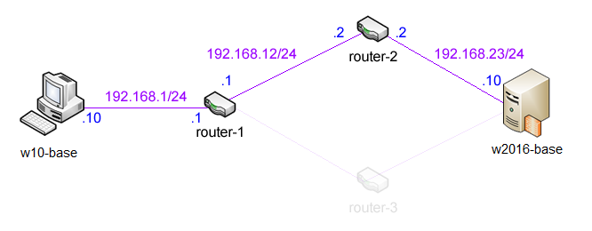

Obrázek 12. Schéma základní topologie sítě

1.  Na **w11** nastavte pomocí grafického rozhraní příslušnou *IPv4
    adresu*, *masku podsítě* a *výchozí bránu* na základě schématu na
    obrázku 12

    a.  Otevřete okno **Network Connections** (Settings -- Network &
        Internet -- Ethernet -- Change adapter options), zvolte *LAN2* a
        pak *Properties*
    -   Zvolené síťové rozhraní musí odpovídat *Private1*, standardně to je LAN2

    b.  Vyberte *Internet Protocol Version 4 (TCP/IPv4)* a zvolte
        *Properties*

    c.  Zvolte *Use the following IP address* a jako *IP address* zadejte
        **192.168.1.10**

    d.  Klikněte do zadávacího pole u *Subnet mask*, maska podsítě bude
        doplněna automaticky
    > :warning: Maska podsítě je doplňována automaticky na
            základě tříd IPv4 adres, ale dnes už se používá
            rozdělování na základě CIDR]

    e.  U Default gateway zadejte **192.168.1.1**

    f.  Potvrďte OK

2.  Na **w2022** nastavte pomocí příkazové řádky příslušnou *IPv4
    adresu*, *masku podsítě* a *výchozí bránu* na základě schématu na
    obrázku 12

    a.  Spusťte následující příkaz `netsh interface ip set address
        name=\"Ethernet 2\" source=static addr=192.168.23.10
        mask=255.255.255.0 gateway=192.168.23.2`

    -   Název **name** musí odpovídat síťovému rozhraní *Private4*,
        standardně to je **LAN2**

3.  Vytvořte VM **router-1** s použitím **VHDX** disku s Mikrotik. Je třeba mít pro každý router vlastní kopii VHDX disku.

4.  Na **router-1** nastavte pomocí konzolového rozhraní **Mikrotik
    RouterOS** příslušné *IPv4 adresy* a *masky podsítě* na základě
    schématu na obrázku 12

    a.  Přihlaste se na **router-1** (přihlašovací jméno **admin**, bez
        hesla)

    b.  Spusťte příkaz `/ip address add interface=ether1
        address=192.168.1.1/24`

    c.  Spusťte příkaz `/ip address add interface=ether2
        address=192.168.12.1/24`

5.  Vytvořte VM **router-ě** s použitím **VHDX** disku s Mikrotik. Je třeba mít pro každý router vlastní kopii VHDX disku.

6.  Na **router-2** nastavte pomocí konzolového rozhraní **Mikrotik
    RouterOS** příslušné *IPv4 adresy* a *masky podsítě* na základě
    schématu na obrázku 12

    a.  Přihlaste se na **router-2** (přihlašovací jméno **admin**, bez
        hesla)

    b.  Spusťte příkaz `/ip address add interface=ether1
        address=192.168.12.2/24`

    c.  Spusťte příkaz `/ip address add interface=ether2
        address=192.168.23.2/24`

7.  Z **w11** se připojte pomocí **WinBoxu** na **router-1** a
    nastavte směrovací tabulky

    a.  Spusťte webový prohlížeč a zadejte adresu **192.168.1.1**

    b.  Stáhněte a spusťte **WinBox**

    c.  Zadejte adresu **192.168.1.1** a zvolte connect

    d.  Zvolte IP -\> Routes, pak add (červené plus)

    e.  Nastavte Dst. Address na **192.168.23.0/24** a jako Gateway
        zvolte **192.168.12.2**

    f.  Potvrďte OK

8.  Z **w2022** se připojte pomocí **WinBoxu** na **router-2** a
    nastavte směrovací tabulky

    a.  Spusťte webový prohlížeč a zadejte adresu **192.168.23.2**

    b.  Stáhněte a spusťte **WinBox**

    c.  Zadejte adresu **192.168.23.2** a zvolte connect

    d.  Zvolte IP -\>Routes, pak add (červené plus)

    e.  Nastavte Dst. Address na **192.168.1.0/24** a jako Gateway
        zvolte **192.168.12.1**

    > :warning: Nastavení směrování v opačném směru je nutné,
            jinak nemůže dorazit odpověď na **ping**.

    f.  Potvrďte OK

9.  Na **w2022** povolte ping pro IPv4

    a.  Spusťte **Windows Firewall with Advanced Security**

    b.  V Inbound Rules povolte pravidlo File And Printer Sharing (Echo
        Request - ICMPv4-In)

10. Na **w11** ověřte konektivitu příkazem `ping 192.168.23.10`

### **Lab L03 -- Wireshark** [^8]

> **Cíl cvičení**
>
> Seznámit se s nástrojem na zachytávání a analýzu síťové komunikace.
>
> **Potřebné virtuální stroje**
>
> **w11**
>
> **w2022**
>

Na **w2022** nainstalujte[^8] **Wireshark** a
předveďte jeho možnosti. Ukažte jak vybrat rozhraní, na kterých se mají
data zachytávat. Zmiňte taky, že *user-friendly* zobrazení zachycených
dat obstarávají *parsery*. Vysvětlete rozdíl mezi *capture* a
*display* filtry.

Instalaci na virtuální stroj proveďte pomocí `winget install -e --id WiresharkFoundation.Wireshark`.

1. Vytvořte session pro zachytávání dat na rozhraní **LAN2**

2. Následně z **w11** pingněte **w2022** a ukončete zachytávání.
Projděte zachycená data a demonstrujte použití filtrů (např. **IPv4**,
**ICMP**, **IPv4.Address == 192.168.1.10, ...**). Předveďte detaily,
Message Stack a jednotlivé vrstvy, ...

### **Lab L04 -- Zavedení IPv6 ve vytvořené síti**

> **Cíl cvičení**
>
> Nastavit všechny stanice a směrovače tak, aby využívaly IPv6 pro
> komunikaci.
>
> **Potřebné virtuální stroje**
>
> **w11** (w11)
>
> **w2022** (w2022 FIT)
>
> **Další prerekvizity**
>
> Nainstalovaný **Mikrotik RouterOS *** na **router-1** a
> **router-2**, stažený **WinBox** (viz. úkol **L02**)

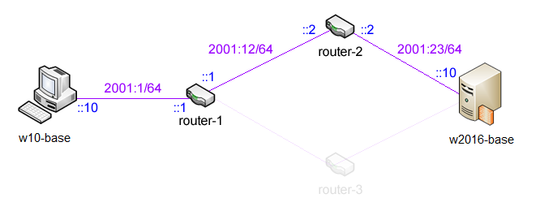

Obrázek 13. Schéma základní topologie sítě pro IPv6

1.  Na **w11** nastavte pomocí grafického rozhraní příslušnou *IPv6
    adresu* a *prefix* na základě schématu na obrázku 13

    a.  Otevřete okno **Network Connections**, zvolte LAN2 a pak
        Properties

    -   Zvolené síťové rozhraní musí odpovídat *Private1*,
        standardně to je LAN2

    b.  Vyberte Internet Protocol Version 6 (TCP/IPv6) a zvolte
        Properties

    c.  Zvolte Use the following IPv6 address a jako IPv6 address
        zadejte **2001:1::10**

    d.  Klikněte do zadávacího pole u Subnet prefix length, prefix bude
        doplněn automaticky

    > :warning:  Podle specifikace IPv6 **individuálních**
        (*unicast*) adres se předpokládá, že prvních 64 bitů
        identifikuje (pod)síť a zbylých 64 bitů
        rozhraní.

    > :warning: Výchozí bránu není potřeba specifikovat, bude
        automaticky zjištěna pomocí *router
        discovery*.

    e.  Potvrďte OK

2.  Na **w2022** nastavte pomocí příkazové řádky příslušnou *IPv6
    adresu* a *prefix* podle schématu na obrázku 13

    a.  Spusťte následující příkaz `netsh interface ipv6 set address
        interface=\"LAN2\" address=2001:23::10/64 type=unicast
        store=persistent`

    -   Název **interface** musí odpovídat síťovému rozhraní
        *Private4*, standardně to je **LAN2**

    > :warning: Typ adresy může být buď *unicast* nebo *anycast*, pokud se
        nespecifikuje, použije se *unicast*.

    > :warning: Způsob uložení (*store*) určuje dobu platnosti nastavení,
        na rozdíl od IPv4 totiž IPv6 umožňuje i dočasné adresy,
        jenž platí jen do nejbližšího restartu počítače
        (*active*), výchozí nastavení je platnost napořád
        (*persistent*).

1.  Z **w11** se připojte pomocí **WinBoxu** na **router-1** a
    nastavte tam IPv6 adresy a směrovací tabulky

    a.  Zvolte IPv6 -\> Addresses, pak add (červené plus)

    b.  U Address nastavte **2001:1::1/64** a u Interface zvolte
        **ether1**

    c.  Potvrďte OK

    d.  Opakuje pro Address **2001:12::1/64** a Interface **ether2**

    e.  Zvolte IPv6 -\> Routes, pak add (červené plus)

    f.  Nastavte Dst. Address na **2001:23::/64** a jako Gateway zvolte
        **2001:12::2**

    g.  Potvrďte OK

2.  Z **w2022** se připojte pomocí **WinBoxu** na **router-2** a
    nastavte tam opět IPv6 adresy a směrovací tabulky

    a.  Zvolte IPv6 -\> Addresses, pak add (červené plus)

    b.  U Address nastavte **2001:12::2/64** a u Interface zvolte
        **ether1**

    c.  Potvrďte OK

    d.  Opakuje pro Address **2001:23::2/64** a Interface **ether2**

    e.  Zvolte IPv6 -\> Routes, pak add (červené plus)

    f.  Nastavte Dst. Address na **2001:1::/64** a jako Gateway zvolte
        **2001:12::1**

    g.  Potvrďte OK

3.  Na **w2022** povolte ping pro IPv6

    a.  Spusťte **Windows Firewall with Advanced Security**

    b.  V Inbound Rules povolte pravidlo File And Printer Sharing (Echo
        Request - ICMPv6-In)

4.  Na **w11** ověřte konektivitu příkazem `ping -6 2001:23::10`

5.  Ověřte správnou funkčnost IPv6

    a.  Otevřete **Wireshark** a spusťte zachytávání dat na
        **LAN2**

    -   Síťové rozhraní pro zachytávání musí odpovídat *Private1*,
        standardně to je **LAN2**

    b.  Z **w11** pingněte **w2022** příkazem z bodu 6

    c.  Zastavte zachytávání a ověřte, že komunikace opravdu probíhá přes
        IPv6

    > :warning: Při analýze zachycené komunikace můžete zjistit, že zdrojová
        IPv6 adresa posílaných dat je jiná než dříve nastavená IPv6
        adresa, systém Windows totiž automaticky generuje sadu
        (unikátních) IPv6 adres pro každou stanici.

## **Studentské úkoly**

**Lab S00 -- konfigurace virtuálních stanic**

Připojte sítové adaptéry stanic k následujícím virtuálním přepínačům:

| **Adaptér (MAC suffix)** | **LAN1 (-01)** | **LAN2 (-02)** | **LAN3 (-03)** | **LAN4 (-04)** |
| ------------------------ | -------------- | -------------- | -------------- | -------------- |
| **w11**                  | Nepřipojeno    | Private1       | Nepřipojeno    | Nepřipojeno    |
| **w2022**                | Nepřipojeno    | Private4       | Nepřipojeno    | Nepřipojeno    |
| **router-1**             | Private1       | Private2       | Private3       | Nepřipojeno    |
| **router-2**             | Private2       | Private4       | Nepřipojeno    | Nepřipojeno    |
| **router-3**             | Private3       | Private4       | Nepřipojeno    | Nepřipojeno    |

-   v případech, kdy je potřeba přistupovat na externí síť
    z **w11** a **w2022**, připojte adaptér **LAN1** k
    přepínači *Default switch*.

**Lab S01 -- Nastavení priority cest pro směrování**

> **Cíl cvičení**
>
> Vytvořit druhou komunikační cestu mezi **w11** a **w2022** a
> naučit se nastavovat priority jednotlivých cest pomocí metrik.
>
> **Potřebné virtuální stroje**
>
> **w11** (W11)
>
> **w2022** (W2022)
>
> **Další prerekvizity**
>
> Dokončený úkol **Lab L02**

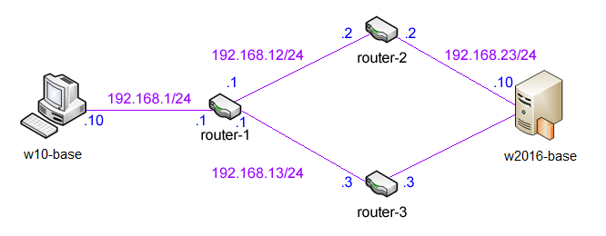
Obrázek 14. Schéma úplné topologie sítě

1.  Vytvořte VM **router-3** s použitím **VHDX** disku s Mikrotik. Je třeba mít pro každý router vlastní kopii VHDX disku. z předchozího Labu.

2.  Na **router-3** nastavte pomocí konzolového rozhraní **Mikrotik
    RouterOS** příslušné *IPv4 adresy* a *masky podsítě* na základě
    schématu na obrázku 14

    a.  Přihlaste se na **router-3** (přihlašovací jméno **admin**, bez
        hesla)

    b.  Spusťte příkaz `/ip address add interface=ether1
        address=192.168.13.3/24`

    c.  Spusťte příkaz `/ip address add interface=ether2
        address=192.168.23.3/24`

3.  Z **w11** se připojte pomocí **WinBoxu** na **router-1** a
    nastavte *IPv4 adresu*, *masku podsítě* a směrovací tabulky

    a.  Spusťte **WinBox**

    b.  Zadejte adresu **192.168.1.1** a zvolte connect

    c.  Zvolte IP -\> Addresses, pak add (červené plus)

    d.  Nastavte Address na **192.168.13.1/24** a u Interface zvolte
        **ether3**

    e.  Potvrďte OK

    f.  Zvolte IP -\> Routes, pak add (červené plus)

    g.  Nastavte Dst. Address na **192.168.23.0/24** a jako Gateway
        zvolte **192.168.13.3**

    h.  Nastavte Distance na **10**

    i.  Potvrďte OK

4.  Z **w2022** se připojte pomocí **WinBoxu** na **router-3** a
    nastavte směrovací tabulky

    a.  Spusťte **WinBox**

    b.  Zadejte adresu **192.168.23.3** a zvolte connect

    c.  Zvolte IP -\> Routes, pak add (červené plus)

    d.  Nastavte Dst. Address na **192.168.1.0/24** a jako Gateway zvolte
        **192.168.13.1**

    e.  Potvrďte OK


5.  Z **w11** proveďte trasování cesty příkazem `tracert
    192.168.23.10` a ověřte, že komunikace probíhá skrz **router-1**
    a **router-2**

6.  Z **w11** se připojte pomocí **WinBoxu** na **router-1** a
    změňte metriky cest

    a.  Zvolte IP -\> Routes

    b.  Vyberte záznam s Dst. Address **192.168.23.0/24** a Gateway
        **192.168.12.2 reachable ether2**

    c.  Dvojklikem otevřete detaily záznamu

    d.  Změňte Distance na **20**

    e.  Potvrďte OK

7.  Z **w11** opět proveďte trasování cesty příkazem **tracert
    192.168.23.10** a ověřte, že tentokrát probíhá komunikace skrz
    **router-1** a **router-3**

**Lab S02 -- Generování IPv6 adres podle IPv6 specifikace**

> **Cíl cvičení**
>
> Změnit generování IPv6 adres na systém využívající modifikovaný EUI-64
> formát.
>
> **Potřebné virtuální stroje**
>
> **w2022**

1.  Vypište informace o rozhraní **LAN2** příkazem `ipconfig /all`

    -   Síťové rozhraní musí odpovídat *Private1*, standardně to je
        **LAN2**

2.  Ověřte, že vygenerovaná IPv6 adres není vytvořena na základě fyzické
    (*MAC*) adresy

3.  Spusťte příkaz `netsh interface ipv6 set global
    randomizeidentifiers=disabled` a chvíli vyčkejte

4.  Opět vypište informace o rozhraní **LAN2** příkazem `ipconfig
    /all`

    -   Síťové rozhraní musí odpovídat *Private1*, standardně to je
        **LAN2**

    -   Vygenerovaná IPv6 adresa již bude vytvořena podle specifikace
        IPv6, lze snadno ověřit, že část adresy identifikující
        rozhraní je odvozena z fyzické (*MAC*) adresy

**Lab S03 -- Vypnutí IPv6**

> **Cíl cvičení**
>
> Ukázat možnosti vypínání IPv6, jelikož odinstalace není možná.
>
> **Potřebné virtuální stroje**
>
> **w2022**
>
> **Další prerekvizity**
>
> Dokončený úkol **Lab L02** (stačí z hlediska konfigurace **router-2**)

1.  Ověřte IPv6 konektivitu s **router-2** pomocí příkazu `ping -6
    2001:23::2`

2.  Zakažte IPv6 pro rozhraní **LAN2**

    a.  Otevřete okno **Network Connections**, zvolte LAN2 a pak
        Properties

    -   Zvolené síťové rozhraní musí odpovídat *Private1*,
        standardně to je LAN2

    b.  Odškrtněte zaškrtávátko u Internet Protocol Version 6 (TCP/IPv6)

3.  Zkuste pingnout **router-2** pomocí příkazu z bodu 1

    -   Spojení s **router-2** nebude možné pomocí IPv6 nevázat, IPv4
        bude pracovat v pořádku

4.  Ověřte IPv6 konektivitu na lokální počítač, příkaz `ping -6 ::1`

    -   Spojení s lokálním počítačem proběhne v pořádku

5.  Vypište všechna rozhraní přítomná v počítači pomocí `ipconfig
    /all`

    -   V seznamu budou rozhraní jako **Teredo Tunneling
        Pseudo-Interface** a **Microsoft ISATAP Adapter**, jenž slouží
        pro tunelování IPv6

6.  Zakažte globálně IPv6

    a.  Otevřete **Registry Editor** (příkaz `regedit`)

    b.  Vytvořte záznam HKEY_LOCAL_MACHINE \\ SYSTEM \\ CurrentControlSet \\
        Services \\ tcpip6 \\ Parameters \\ DisabledComponents typu DWORD
        a nastavte mu hodnotu **0xFF**

    c.  Restartujte **w2022**


7.  Ověřte IPv6 konektivitu na lokální počítač, příkaz `ping -6 ::1`

    -   Spojení s lokálním počítačem opět proběhne v pořádku

8.  Vypište všechna rozhraní přítomná v počítači pomocí `ipconfig
    /all`

    -   V seznamu již nebudou rozhraní jako **Teredo Tunneling
        Pseudo-Interface** a **Microsoft ISATAP Adapter**, také
        ostatní rozhraní jako **LAN2** nebudou používat IPv6 i přesto,
        že ho mají povolen

[^1]: Koncovým bodem se rozumí proces či aplikace, která *vytváří* nebo
    *zpracovává* **aplikační** data. Zařízení, jenž data pouze přijme a
    pošle dále (případně analyzuje či modifikuje hlavičky), tedy, pro
    něž nejsou tato data určena, není koncovým bodem.

[^2]: Cílový koncový uzel vždy čte zaslané pakety ve správném pořadí,
    ale dorazit mohou tyto pakety v různém pořadí (může dojít ke ztrátě
    některých paketů při přenosu, ty pak musí být zaslány znovu)

[^3]: Směrovačem je myšleno jakékoliv zařízení, jenž je schopné směrovat
    příchozí *datagramy*

[^4]: Propojení označuje oblast sítě, jenž je dostupná pouze pomocí
    linkové vrstvy ISO/OSI modelu (vrstvy fyzického rozhraní TCP/IP
    modelu), např. počítače propojené ethernet kabely skrz rozbočovač
    (*hub*) jsou propojeny

[^5]: V praxi posílají směrovače prvních 64 bitů IPv6 adresy, tedy vše
    kromě modifikované EUI-64 adresy rozhraní, kterou si může každé
    síťové rozhraní vygenerovat samo bez dodatečných informací

[^6]: Tento typ adresy se povinný pro směrovače, v praxi lze jako
    výběrové adresy použít také individuální adresy

[^7]:

[^8]: Link [Wireshark](https://www.wireshark.org)

[^9]: Pro přenos lze využít rozšířenou session k w2022 a přenos pomocí kopírovat-vložit

[^10]: Link https://docs.microsoft.com/en-us/message-analyzer/configuring-a-remote-capture?redirectedfrom=MSDN#BKMK_PromiscuousMode

[^11]: Link https://social.technet.microsoft.com/Forums/windows/en-US/48b4c226-fc3d-4793-b544-3440ed13424a/microsoft-message-anlayzer-14-a-digitally-signed-driver-is-required?forum=messageanalyzer

[^12]: Link https://www.wireshark.org/
