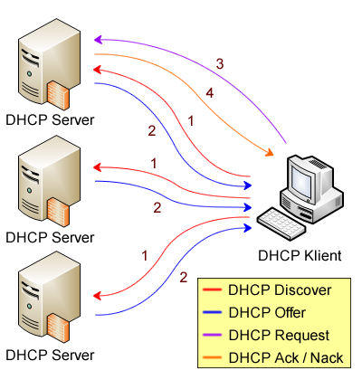
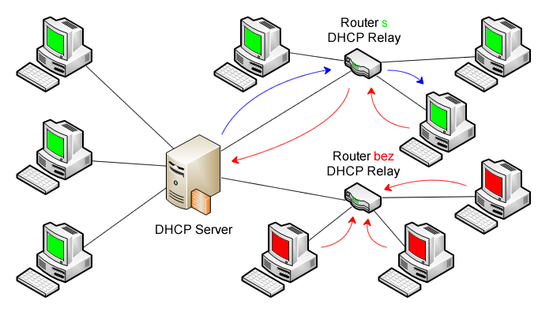

- [**Systém DHCP**](#systém-dhcp)
  - [**Služba DHCP**](#služba-dhcp)
  - [**Přidělování IPv4 adres pomocí DHCP**](#přidělování-ipv4-adres-pomocí-dhcp)
  - [**DHCP relay**](#dhcp-relay)
- [AutomatedLab](#automatedlab)
- [**Společné úkoly**](#společné-úkoly)
- [**Lektorské úkoly**](#lektorské-úkoly)
  - [**Lab L01 -- Instalace a základní nastavení DHCP serveru**](#lab-l01----instalace-a-základní-nastavení-dhcp-serveru)
  - [**Lab L02 -- Pokročilé nastavení DHCP serveru**](#lab-l02----pokročilé-nastavení-dhcp-serveru)
- [**Studentské úkoly**](#studentské-úkoly)
  - [**Lab S01 -- Vytvoření rezervace pro DHCP klienta**](#lab-s01----vytvoření-rezervace-pro-dhcp-klienta)
  - [**Lab S02 -- Aplikace nastavení DHCP na základě user class**](#lab-s02----aplikace-nastavení-dhcp-na-základě-user-class)

<style type="text/css">
    img {background-color: white;}
</style>

# **Systém DHCP**

Zajištění konektivity mezi počítači v malé (např. domácí) síti je celkem
jednoduché, stačí manuálně nastavit jednotlivá síťová rozhraní. Často to
není ani nutné, jelikož lze využít automatické přidělování IPv4 adres
pomocí systému **APIPA**. Pokud ovšem pracujeme ve větší síti, což je v
případě existence serverů pravděpodobné, nejsou předchozí možnosti
příliš použitelné. Manuální konfigurace je pracná a náchylná na chyby
způsobené uživatelem (chybně zadané údaje apod.). Použití systému
**APIPA** je nepřijatelné, jelikož pravděpodobnost, že se podaří každému
počítači vygenerovat do deseti pokusů unikátní IPv4 adresu je v tomto
počtu mizivá.

**Systém DHCP** slouží k automatické konfiguraci síťových rozhraní.
Umožňuje nastavit IPv4 adresy, masky podsítě, výchozí brány, adresy
**DNS** a **WINS** serverů a další informace. Konfigurace jednotlivých
rozhraní je realizována pomocí protokolu **DHCP** (*Dynamic Host
Configuration Protocol*), který vzniknul jako rozšíření protokolu
**BOOTP**, jenž sloužil pro *bootování* bezdiskových stanic. **BOOTP**
byl schopen přidělovat jen IPv4 adresu, masku podsítě, adresu **TFTP**
(*Trivial File Transfer Protokol*) serveru, který obsahoval *bootovací*
obraz, a cestu k tomuto obrazu. Protože **DHCP** je rozšíření protokolu
**BOOTP**, je s ním také zpětně kompatibilní.

## **Služba DHCP**

Stejně jako v případě **DNS** lze i zde **službu** **DHCP** rozdělit na
dvě části. První část tvoří **DHCP** server, jenž obsahuje informace o
IPv4 adresách přidělených jednotlivým rozhraním. Druhou částí je
**DHCP** klient, který zjišťuje informace potřebné pro konfiguraci
jednotlivých síťových rozhraní.

Jak již bylo řečeno výše, pro komunikaci se využívá **DHCP** protokol,
jenž běží na protokolem **UDP** na portech **67** (server) a **68**
(klient). Komunikace je vždy realizována pomocí všesměrového vysílání
(*broadcast*), jelikož ten jediný lze použít i v případě, že rozhraní
ještě nemá přidělenou IP adresu.

## **Přidělování IPv4 adres pomocí DHCP**

Princip přidělování IPv4 adres je znázorněn na obrázku 4 níže. Postup
lze shrnout do následujících několika kroků:

1.  **DHCP** klient zašle všesměrovou (*broadcast*) zprávu **DHCP
    > Discover** všem **DHCP** serverům na dané síti, touto zprávou žádá
    > o přidělení IPv4 adresy.

2.  Každý **DHCP** server zašle zpět všesměrovou (*broadcast*) zprávu
    > **DHCP Offer**, která obsahuje IPv4 adresu, jenž server nabízí k
    > použití. V případě, že **DHCP** server nemá již k dispozici žádné
    > volné IPv4 adresy pro zapůjčení, nijak na žádosti nereaguje.

3.  **DHCP** klient čeká na nabídky od **DHCP** serverů. Z přijatých
    > nabídek vybere jedinou (nejčastěji první příchozí) a odpoví na ni
    > opět všesměrovou (*broadcast*) zprávou **DHCP Request**, kterou
    > stvrzuje svůj zájem o použití nabízené IPv4 adresy.

4.  **DHCP** server, jenž nabídl danou IPv4 adresu, ověří, zda je možné
    > tuto IPv4 adresu opravdu zapůjčit a v případě, že ano, zašle zpět
    > všesměrovou (*broadcast*) zprávou **DHCP Ack**, kterou potvrzuje
    > zapůjčení této IPv4 adresy. Pokud IPv4 adresu již z nějakého
    > důvodu nelze zapůjčit (např. již zatím byla zapůjčena jinému
    > rozhraní), odpoví všesměrovou (*broadcast*) zprávou **DHCP Nack**
    > a **DHCP** klient musí zažádat o novou (jinou) IPv4 adresu.



Obrázek 1. Průběh přidělování IPv4 adres pomocí DHCP (DORA)

Tento postup je často označován jako **DORA** (*Discover*, *Offer*,
*Request*, *Ack*) a popisuje přidělování IPv4 adres klientům, jenž ještě
nemají přidělenou žádnou IPv4 adresu. Adresa je vždy zapůjčována jen na
určitou dobu, kterou určuje **DHCP** server. **DHCP** klient pak musí
pravidelně tuto dobu prodlužovat zasíláním žádostí o prodloužení
výpůjčky (*lease renewal*).

Po vypršení 50% doby platnosti výpůjčky IPv4 adresy se začne **DHCP**
klient pokoušet prodloužit dobu její platnosti. Prodloužení je
realizováno zasláním normální (*unicast*) zprávy **DHCP Request**
**DHCP** serveru, jenž zapůjčil danou IPv4 adresu. Ten buď potvrdí
prodloužení výpůjčky pomocí zprávy **DHCP Ack** nebo zamítne pomocí
**DHCP Nack**. Pokud je prodloužení zamítnuto, klient si ponechá IPv4
adresu do konce doby její platnosti a pak si zažádá o novou. V případě,
že se **DHCP** klientovi nepodaří prodloužit výpůjčku do 87,5% doby její
platnosti, pokusí se klient kontaktovat jakýkoliv **DHCP** server, který
ji může prodloužit. Prodloužení se provede jako v předchozím případě,
jen **DHCP Request** je zaslán všesměrově (*broadcast*) všem serverům.
Pokud se **DHCP** klientovi vůbec nepodaří prodloužit výpůjčku do
vypršení její doby platnosti, znovu zažádá po vypršení o novou IPv4
adresu.

## **DHCP relay**

Hlavní nevýhodou **DHCP** je jeho závislost na všesměrovém vysílání
(*broadcast*), **DHCP** zprávy tedy nelze standardně šířit za hranice
směrovačů do jiných (pod)sítí. **DHCP relay** slouží k přeposílání
**DHCP** zpráv do jiných sítí, přesněji k směrování **DHCP** zpráv z
dané (pod)sítě na **DHCP** server v jiné (pod)síti a naopak. Funkce DHCP
relay je ilustrována na obrázku 5 níže.



Obrázek 2. Ilustrace funkce DHCP relay

Z obrázku 5 výše je vidět, že klienti z jiné (pod)sítě, jenž jsou
spojeni se směrovačem (*router*), který má podporu **DHCP relay**, jsou
schopni získat IPv4 adresu od **DHCP** serveru, zatímco jiní klienti za
směrovačem bez podpory **DHCP relay** ne, jelikož jejich požadavky se
nedostanou k **DHCP** serveru.

---

# AutomatedLab

```pwsh
$labName = 'E03'

New-LabDefinition -Name $labName -DefaultVirtualizationEngine HyperV
Set-LabInstallationCredential -Username root -Password root4lab

Add-LabVirtualNetworkDefinition -Name Private1


$w11_network = @(
    New-LabNetworkAdapterDefinition -UseDhcp -InterfaceName Ethernet -VirtualSwitch Private1
)

Add-LabMachineDefinition -Name w11   -Memory 2GB -NetworkAdapter $w11_network -OperatingSystem 'Windows 11 Pro'

$w2022_network = @(
    New-LabNetworkAdapterDefinition -UseDhcp -InterfaceName Ethernet -VirtualSwitch Private1
)

Add-LabMachineDefinition -Name w2022 -Memory 2GB -NetworkAdapter $w2022_network -OperatingSystem 'Windows Server 2022 Datacenter Evaluation (Desktop Experience)'

Install-Lab

Show-LabDeploymentSummary -Detailed

```

---

# **Společné úkoly**

-   Rozsah IP adres přidělených z *Default switch* se může od níže
    uvedeného rozsahu lišit.

-   Nepřipojené síťové daptéry je doporučeno zakázat uvnitř VM.

**Lab LS00 -- konfigurace virtuálních stanic**

Připojte sítové adaptéry stanic k následujícím virtuálním přepínačům:

| **Adaptér (MAC suffix)** | **Ethernet (1)** |
| ------------------------ | ---------------- |
| **w11**                  | Private1         |
| **w2022**                | Private1         |

-   v případech, kdy je potřeba přistupovat na externí síť, připojte
    adaptér **LAN1** k přepínači *Default switch*.

# **Lektorské úkoly**

## **Lab L01 -- Instalace a základní nastavení DHCP serveru**

> **Cíl cvičení**
>
> Povýšit server do role **DHCP** serveru a nastavit nový rozsah
> (*scope*) pro přidělování IPv4 adres, ověřit funkčnost připojením
> klienta do sítě
>
> **Potřebné virtuální stroje**
>
> **w11**
>
> **w2022**

1. Přihlaste se k **w2022** jako uživatel **root** s heslem **root4lab**

2. Na **w2022** nastavte statickou IPv4 adresu **192.168.1.1**

    a.  Otevřete okno **Network Connections** (Settings -- Network & Internet --
    Ethernet -- Change adapter options), zvolte Ethernet a pak Properties

    b.  Zvolené síťové rozhraní musí odpovídat *Private1*, standardně to je Ethernet

    b.  Vyberte Internet Protocol Version 4 (TCP/IPv4) a zvolte Properties

    c.  Zvolte Use the following IP address a jako IP address zadejte
    **192.168.1.1**

    d.  Klikněte do zadávacího pole u Subnet mask, maska podsítě
    **255.255.255.0** bude doplněna automaticky

    e.  Potvrďte OK

3. Spusťte **Server Manager**

    a. Start → **Server Manager**

    -  Doporučení: automaticky spuštěný server manager nejdříve zavřít (jinak
    si průvodce přidáním DHCP může stěžovat na chybějící statickou IP)

4. Nainstalujte roli **DHCP** server

   a. Vyberte Add Roles and Features z nabídky Manage

   b. Pokračujte Next \>

   c. Vyberte Role-based or feature-based installation a pokračujte Next \>

   d. Vyberte aktuální server a pokračujte Next \>

   e. V seznamu rolí vyberte DHCP Server, potvrďte přidání potřebných funkcí
    Add Features a pokračujte třikrát Next \>

   f. Potvrďte instalaci Install

    - Trvá cca 3 minuty (restart není potřeba)

   g. Po dokončení instalace najdete v notifikacích Server Manageru odkaz na
    Post-deployment Configuration DHCP serveru (Complete DHCP configuration)

   h. V poinstalační průvodci potvrďte bezpečnostní skupiny pomocí Commit a
    následně Close

5. Nakonfigurujte **DHCP server** - vytvořte nový rozsah **192.168.1.10 --
192.168.1.100** pro přidělování IPv4 adres klientům (rozhraním)

    a. Spusťte DHCP Manager

    - Poznámka: od 2012 již není průvodce konfigurací při instalaci role

    - Buď z nabídky Tools -- DHCP nebo vyberte v levém sloupci roli DHCP a
        z kontextové nabídky nad jménem serveru zvolte DHCP Manager

    b. V DHCP konzoli zvolte Add/Remove Bindings... z nabídky nad
    **w2022**
    > :warning: Nastavení slouží k navázání **DHCP** serveru na
    konkrétní rozhraní, na kterém bude naslouchat na příchozí **DHCP**
    zprávy (následně okno zavřete)

    c. V DHCP konzoli rozbalte uzel **w2022 -- IPv4**

    d.  Z kontextové nabídky nad **IPv4** zvolte New scope

      1. U Scope name zvolte název **Private1**, pokračujte Next \>

      2. Start IP address nastavte na **192.168.1.10** a End IP address na  **192.168.1.100**

      3. Zkontrolujte, že automaticky vyplněné pole Subnet mask obsahuje správnou masku podsítě **255.255.255.0**, pokračujte Next \>

      4. Zmiňte, k čemu slouží Exclusions a pokračujte Next \>

      5. Nastavte Lease Duration na **8 hodin** (zmiňte, k čemu slouží, kdy je dobré nastavit kratší interval apod.), pokračujte Next \>

      6. V nastavení Configure DHCP Options vysvětlete, k čemu slouží, zvolte Yes,... a Next \>

      7. Default Gateway nenastavujte, Next \>

         -   Nastavuje se později ve studentském úkolu.

      8. V nastavení Domain Name and DNS Servers zadejte jako Parent Domain
        doménu **testing2.local** a do DNS server IP address adresu
        **192.168.1.1** a pokračujte Next \>

            > :warning: Tyto informace jsou zaslány spolu s IPv4 adresou **DHCP** klientovi a slouží k nastavení **DNS** serverů a **DNS** *suffixů* pro dané síťové rozhraní, **DNS** server bude nainstalován později v rámci jiného úkolu

            > :warning: Proběhne validace (ověření konektivity na DNS server) a upozornění, že na zadané IP není DNS server, přesto jej přidáme Yes

      9. V části WINS Servers nic nenastavujte a pokračujte Next \>

      10.  Zvolte Yes, I want to activate this scope now pro aktivaci vytvořeného rozsahu a pokračujte Next \> a Finish
      > :warning: Zmiňte, že rozsah (*scope*) je potřeba aktivovat, aby začal poskytovat IPv4 adresy

1. Přihlaste se k **w11** jako uživatel **student** s heslem **root4lab**

2. Na **w11** vynuťte obnovení IPv4 adresy

    a. Spusťte příkaz **ipconfig /renew**

3. Ověřte, že **w11** obdržel od **DHCP** serveru IPv4 adresu z
nastaveného rozsahu

## **Lab L02 -- Pokročilé nastavení DHCP serveru**

> **Cíl cvičení**
>
> Seznámit se s pokročilýminastaveními DHCP serveru.
>
> **Potřebné virtuální stroje**
>
> **w2022**
>
> **Další prerekvizity**
>
> Dokončený úkol **Lab L01**

Otevřete **DHCP** konzoli (buď samostatně, nebo v rámci **Server
Manageru**) a projděte pokročilejší možnosti nastavení **DHCP** serveru.
Ukažte, že informace, jenž jsou obsažené v **DHCP** zprávách spolu
s přidělenou IPv4 adresou, lze nastavovat na úrovních *serveru*,
*rozsahu* nebo jednotlivých *rezervací*. Vysvětlete, k čemu jsou dobré
rezervace. Zmiňte, že ve Windows Server lze vytvářet super rozsahy
(*superscopes*) a k čemu jsou. Také řekněte, proč jsou potřeba *exclude*
rozsahy a ukažte, kde se dají nastavit. Nakonec proberte filtry, které
lze využít pro výběr klientů, kterým bude daný DHCP server poskytovat
své služby, mají na to pak bodovaný úkol.

# **Studentské úkoly**

## **Lab S01 -- Vytvoření rezervace pro DHCP klienta**

> **Cíl cvičení**
>
> Na **DHCP** serveru vytvořit rezervaci pro klienta a ověřit, v jakém
> pořadí se aplikují nastavení obsažená v **DHCP** zprávách, pokud jsou
> definována na různých úrovních
>
> **Potřebné virtuální stroje**
>
> **w11**
>
> **w2022**
>
> **Další prerekvizity**
>
> Dokončený úkol **Lab L01**

1.  Na **w2022** nastavte na úrovni *serveru* a *rozsahu*
    **Private1** různé výchozí brány

    a.  Spusťte **DHCP**

    b.  V DHCP konzoli rozbalte uzel **w2022 -- IPv4**

    c.  Klikněte pravým na Server Options a zvolte Configure Options...

    d.  V záložce General zaškrtněte možnost 003 Router

    e.  Do IP address zadejte **192.168.1.1** a zvolte Add

    f.  Potvrďte OK

    g.  Rozbalte uzel rozsahu **Private1**

    h.  Zopakujte body **c** - **f** tentokrát pro Scope Options a
        adresu **192.168.1.2**

2.  Na **w11** obnovte přidělenou IPv4 adresu pomocí příkazu
    `ipconfig /renew`
    -   Obnovení IPv4 adresy zároveň obnoví veškerá nastavení, jenž při
        přidělování poskytuje **DHCP** server klientům

3.  Ověřte, že **w11** má nastavenou jako výchozí bránu IPv4 adresu
    `192.168.1.2`
    -   Nastavení na úrovni *rozsahu* mají vždy přednost před
        nastaveními na úrovni *serveru*

4.  Vytvořte pro **w11** rezervaci u **DHCP** serveru

    a.  Na **w11** zjistěte pomocí příkazu `ipconfig /all`
        fyzickou (MAC) adresu rozhraní Ethernet
       -   Síťové rozhraní musí odpovídat *Private1*, standardně to je     Ethernet
       -   (00-10-01-00-00-02)

    b.  Na **w2022** otevřete **DHCP**

    c.  Klikněte pravým na Reservations a zvolte New Reservation...

    d.  Rezervaci pojmenujte **w11** (pole Reservation Name)

    e.  Jako IP address zvolte **192.168.1.50** a do MAC address zadejte
        zjištěnou fyzickou adresu
      - Cílová IP adresa musí být samozřejmě vždy z rozsahu           poskytovaných IPv4 adres
      -   Fyzickou (MAC) adresu lze zadat s i bez pomlček, interně se
            ukládá bez

    f.  Přidejte rezervaci pomocí Add

    g.  Zavřete okno New Reservation pomocí Close

5.  Nastavte výchozí bránu **192.168.1.3** pro rezervaci **w11**

    a.  Klikněte pravým na rezervaci **w11** a zvolte Configure
        Options...

    b.  V záložce General zaškrtněte možnost 003 Router

    c.  Do IP address zadejte **192.168.1.3** a zvolte Add

    d.  Potvrďte OK

6.  Na **w11** opět obnovte přidělenou IPv4 adresu pomocí příkazu
    `ipconfig /renew`

7.  Ověřte, že **w11** má přidělenou IPv4 adresu **192.168.1.50** a
    nastavenou výchozí bránu **192.168.1.3**

    -   IP adresa, jenž je zarezervována pro určitého klienta, nemůže
        být nikdy přidělena jinému klientovi

    -   Nastavení na úrovni jednotlivých rezervací mají vždy přednost
        před stejnými nastaveními na ostatních úrovních

## **Lab S02 -- Aplikace nastavení DHCP na základě user class**

> **Cíl cvičení**
>
> Přidat rozhraní do vytvořené *user class* a ověřit aplikaci nastavení
> pouze na její členy
>
> **Potřebné virtuální stroje**
>
> **w11**
>
> **w2022**
>
> **Další prerekvizity**
>
> Dokončeny úkol **Lab S01**

1. Na **w2022** vytvořte novou *user* *class* s názvem **ugtest**

    a. Spusťte **DHCP**
    
    b. Klikněte pravým na IPv4 a zvolte Define User Classes...

    c. Zvolte Add
    
    d. Do Display Name a části ASCII zadejte **ugtest** (Binary část bude automaticky doplněna)
    e. Potvrďte vytvoření pomocí OK
    f. Zavřete okno DHC User Classes

2. Nastavte adresu **192.168.1.4** jako výchozí bránu pro klienta s *user
class* **ugtest**

    a. V **DHCP** klikněte pravým na rezervaci **w11** a zvolte Configure
    Options...

    b. V záložce Advanced zvolte u User class **ugtest** a zaškrtněte možnost
    003 Router

    c. Do IP address zadejte **192.168.1.4** a zvolte Add

    d. Potvrďte OK

3. Přidejte síťové rozhraní Ethernet na **w11** do *user class* **ugtest**
    > :warning: Síťové rozhraní musí odpovídat *Private1*, standardně to je Ethernet

    a.  Na **w11** spusťte v příkazovém řádku s administrátosrkými
    oprávněními příkaz `ipconfig /setclassid Ethernet ugtest`
    - Nastavení *user class* pro dané rozhraní vyžaduje administrátorské oprávnění

4.  Ověřte, že **w11** má nastavenou jako výchozí bránu IPv4 adresu
    **192.168.1.4**
    -   Nastavení pro konkrétní *user class* má vždy přednost před
        nastavením pro všechny

