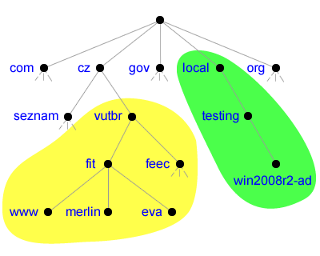
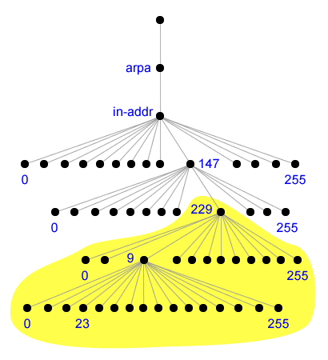

- [**Systém DNS**](#systém-dns)
  - [**Hierarchie DNS**](#hierarchie-dns)
  - [**Služba DNS**](#služba-dns)
  - [**DNS server**](#dns-server)
    - [**DNS záznamy**](#dns-záznamy)
    - [**Přenos zón**](#přenos-zón)
      - [**Výhody integrace DNS serveru v Active Directory**](#výhody-integrace-dns-serveru-v-active-directory)
  - [**DNS klient**](#dns-klient)
  - [**Zóna globálních jmen**](#zóna-globálních-jmen)
  - [**DNS dotazy**](#dns-dotazy)
- [AutomatedLab](#automatedlab)
- [Společné úkoly](#společné-úkoly)
  - [Lab LS00 -- konfigurace virtuálních stanic](#lab-ls00----konfigurace-virtuálních-stanic)
- [Lektorské úkoly](#lektorské-úkoly)
  - [Lab L01 -- Konfigurace síťových rozhraní](#lab-l01----konfigurace-síťových-rozhraní)
  - [Lab L02 -- Instalace a základní nastavení DNS serveru](#lab-l02----instalace-a-základní-nastavení-dns-serveru)
  - [Lab L03 -- Pokročilá nastavení DNS serveru a klienta](#lab-l03----pokročilá-nastavení-dns-serveru-a-klienta)
- [Studentské úkoly](#studentské-úkoly)
  - [Lab S01 -- Vytvoření reverzního mapování pro IPv4](#lab-s01----vytvoření-reverzního-mapování-pro-ipv4)
  - [Lab S02 -- Vytvoření zóny globálních jmen](#lab-s02----vytvoření-zóny-globálních-jmen)


# **Systém DNS**

**DNS** (*Domain Name System*) je systém pro překlad doménových jmen
(DN, *Domain name*) na IP adresy a opačně. Umožňuje jednoznačně
identifikovat počítač v interní síti nebo na internetu pomocí textového
názvu (jména) namísto IP adresy, jenž je pro normálního uživatele těžko
zapamatovatelná. Často se používají i různá rozšíření doménových jmen
(adres), např. *e-mailová* adresa není nic jiného než doménové jméno
obohacené o identifikaci osoby.

Systém **DNS** lze ovšem výhodně využít i k dalším účelům. Umožňuje
flexibilní práci s IP adresami, kdy změna IP adresy počítače znamená
pouze opravu mapování doménového jména na odpovídající novou IP adresu,
z pohledu klienta nejsou potřeba žádné úpravy. Lze realizovat tzv. *load
balancing*, kdy jedno doménové jméno identifikuje více počítačů
(nejčastěji serverů), jenž poskytují specifickou službu. Klientovi je
pak poskytnuta IP adresa pouze jednoho z těchto počítačů, ideálně
takového, který je nejméně vytížený. Doménové jména se také používají k
rozlišení služeb, např. doménové jména začínající prefixem *www* často
označují *webové* servery.

Systém **DNS** patří mezi decentralizované klient-server systémy,
záznamy jsou tedy rozprostřeny po více serverech a je potřeba
lokalizovat ty servery, které obsahují potřebné informace. Výhodou
decentralizovaného přístupu je jeho robustnost, pokud dojde k výpadku
několika serveru, pořád by mělo existovat dost dalších, které jsou
schopny poskytnout požadované informace. Robustnost je pro systém jako
je **DNS** klíčová vlastnost.

## **Hierarchie DNS**

Systém **DNS** je hierarchický, prostor doménových jmen (*Domain Name
Space*) tvoří obecný strom. Příklad části takovéhoto stromu lze vidět na
obrázku 1. Kořenem stromu (označovaný jako *the root*) je prázdný
(nepojmenovaný) uzel, ostatní uzly stromu jsou pojmenovány textovými
řetězci o délce maximálně 63 znaků, název ovšem nesmí obsahovat tečky.
Tečky slouží jako oddělovače jednotlivých úrovní stromu. Podle
specifikace může mít strom až 127 úrovní.

{width="4.167246281714785in"
height="3.333798118985127in"}

Obrázek 1. Část stromu prostoru doménových jmen

Plně kvalifikované doménové jméno (**FQDN**, *Fully Qualified Domain
Name*) je posloupnost názvů uzlů na cestě ke kořeni oddělená tečkami.
Například pro uzel *www* ve stromu na obrázku 1 bude jeho plně
kvalifikované doménové jméno **www.fit.vutbr.cz.** (s tečkou na konci).
Ukončující tečka vyplývá z existence prázdného kořenového uzlu, i ten je
totiž oddělen tečkou od názvů ostatních uzlů. Často se ovšem tato
poslední tečka vynechává, jelikož musí být vždy přítomná a může být tedy
doplněna automaticky při tvorbě požadavku pro překlad zadaného
doménového jména. Maximální délka plně kvalifikovaného doménového jména
je 255 znaků.

Relativní doménové jméno je jakékoliv doménové jméno bez ukončující
tečky, je interpretováno k relativní doméně, ve které se nachází.
Například když na FIT zadáme relativní doménové jméno **www**, bude
primárně interpretováno jako **www.fit.vutbr.cz.**, jelikož jsme v
doméně **fit.vutbr.cz.**, na relativní doménové jméno lze tedy nahlížet
jako na prefix plně kvalifikovaného doménového jména.

Doména je podstrom ve stromu doménových jmen. Název domény (*Domain
Name*) je cesta mezi uzlem, jenž tvoří vrchol domény, a kořenem celého
stromu. Příkladem mohou být domény **vutbr.cz.** (vyznačena žlutě) a
**local.** (vyznačena zeleně) ve stromu na obrázku 1. Domény prvního
úrovně, jenž mají vzdálenost 1 od kořene stromu, se často označují TLD
(*Top Level Domain*) a jsou buď tematické (např. *org* pro organizace,
*gov* pro vládní a *edu* pro vzdělávací instituce) nebo státní (např.
*cz* pro Českou republiku, *sk* pro Slovenskou republiku). Ostatní
domény se označují podle vzdálenosti od kořene stromu jako domény
druhého řádu, třetího řádu atd. nebo jako subdomény domén nižšího řádu.
Často se jako domény chybně označují samotné uzly doménového stromu, ty
tvoří ovšem jen prefixy konkrétních domén. Na rozdíl od doménových jmen
u domén neexistuje žádný relativní zápis, každá doména musí být plně
určena.

Výhodou stromové hierarchie **DNS** je možnost administrativního
rozdělení jednotlivých domén, kdy konkrétní domény jsou spravovány
samostatnými subjekty (buď organizacemi, nebo soukromými osobami).

Jak bylo již řečeno dříve, systém **DNS** neslouží jen k překladu
doménových jmen na IP adresy, ale také naopak. Tento překlad se označuje
jako *reverzní mapování* a často se využívá k ověření překladu, kdy se
kontroluje, zda IP adresa počítače má v DNS odpovídající doménovou
adresu. Pokud nemá, lze tuto adresu vyhodnotit jako podvrženou nebo
neplatnou. Toto ověření se často provádí u poštovních serverů. Informace
pro tento druh překladu jsou uloženy ve speciální doméně jménem
**in-addr.arpa.**, kde v případě IPv4 tvoří jednotlivé uzly stromu
osmibitová čísla v rozsahu 0 až 255, jenž reprezentují vždy osm bitů
IPv4 adresy. Strom pro reverzní mapování IPv4 adres na odpovídající
doménové jména je zachycen na obrázku 2. Obdobně pro IPv6 adresy
existuje speciální doména **ip6.arpa.**, kde jednotlivé uzly tvoří
čtyřbitová čísla.

{width="3.2035717410323707in"
height="3.5161154855643044in"}

Obrázek 2. Strom pro reverzní překlad IPv4 adres

Například IPv4 adrese **147.229.9.23** bude ve stromu pro reverzní
mapování IPv4 adres odpovídat záznam **23.9.229.147.in-addr.arpa.**, kde
**in-addr.arpa.** je speciální doména druhého řádu.

## **Služba DNS**

Službu **DNS** lze rozdělit na dvě části. První část tvoří **DNS
server**, jenž obsahuje záznamy potřebné pro překlad doménového jména na
IP adresu a zpět. Druhou částí je **DNS klient**, často označovaný jako
tzv. *resolver*, který zprostředkovává překlad doménových jmen
aplikacím.

Pro komunikaci se využívá **DNS** protokol, jenž běží nad protokoly
**TCP** i **UDP** na portu **53**. Většinou se využívá pro přenos na
transportní vrstvě protokol **UDP**, jelikož poskytuje vyšší rychlost
přenosu, což je v případě **DNS** klíčové. Protokol **TCP** se používá
hlavně pro tzv. *zone transfer*, o kterém bude řeč později.

## **DNS server**

**DNS server** zajišťuje samotný překlad doménových jmen na IP adresy a
opačně. Každý **DNS server** se stará pouze o část prostoru doménových
jmen, tedy jen o určitou doménu, může ovšem delegovat správu
jednotlivých subdomén na jiné **DNS servery**. Z hlediska odpovědí lze
rozdělit **DNS servery** na dva typy:

-   **Autoritativní**, které poskytují odpovědi, jenž obsahují vždy
    aktuální informace.

-   **Neautoritativní**, které poskytují odpovědi, jenž mohou obsahovat
    již neplatné informace.

**DNS servery** ovšem nepracují s doménami, nýbrž s tzv. zónami. Přesná
definice zóny neexistuje, většinou je zóna ekvivalentním vyjádřením
domény. Někdy se jako zóna označuje vše, co je obsahem zónového souboru,
což může být více než jen jedna doména. Zóny se dělí na základě
obsažených informací a možností manipulace s těmito informacemi na tři
typy:

-   **Primární** zóna obsahuje veškeré záznamy pro danou doménu a jako
    jediná umožňuje tyto záznamy přímo modifikovat. Primární zóna je
    vždy autoritativní. Windows Server ještě navíc rozlišuje dva
    speciální typy primárních zón podle způsobu jejich uložení:

    -   **Standardní primární zóna**, jenž ukládá záznamy do zónovém
        souboru. Standardně jsou zónové soubory uloženy v adresáři
        ***\<systém\>*\\System32\\dns**, kde *\<systém\>* je kořenový
        adresář systému Windows, a pojmenovány názvem domény, kterou
        zóna obsahuje, s přidanou příponou **.dns**. Např. zónový soubor
        pro doménu **fit.vutbr.cz.** bude standardně uložen v zónovém
        souboru **fit.vutbr.cz.dns**.

    -   **Zóna integrovaná v Active Directory**, jenž ukládá záznamy do
        Active Directory. Zóny jsou pak uloženy v oddílu *domény* nebo
        *aplikace* (podle nastavení rozsahu replikace) v objektu
        kontejneru **dnsZone** určeného názvem domény, jenž zóna
        obsahuje. Tento způsob uložení přináší řadu výhod, jak bude
        popsáno dále.

-   **Sekundární** zóna, stejně jako primární, obsahuje veškeré záznamy
    pro danou doménu. Tyto záznamy jsou ovšem určeny pouze pro čtení,
    nelze je přímo modifikovat, pouze skrz přenos zón (*Zone Transfer*).
    Tato zóna je tedy plnou kopií jiné primární či sekundární zóny a je
    vždy autoritativní.

-   **Stub** zóna obsahuje pouze informace potřebné ke kontaktování
    nějakého autoritativního serveru. Přesněji obsahuje jen SOA a NS
    záznamy společně s A (případně AAAA) záznamy pro překlad doménových
    jmen těchto serverů na odpovídající IP adresy. Tato zóna jako jediná
    není autoritativní.

Zóny se často používají ke kategorizaci **DNS serverů**, kdy na základě
typu zóny, kterou daný server obsahuje, se rozlišují celkem tři typy
**DNS serverů** (někdy se místo typu mluví o roli **DNS serveru**):

-   **Primární** server je server obsahující *primární* zónu a je vždy
    autoritativní.

-   **Sekundární** server je server obsahující *sekundární* zónu a také
    je vždy autoritativní.

-   **Záložní** (*Caching-Only*) server je server obsahující *stub*
    zónu. Tento server plní zároveň úlohu klienta i serveru. Uchovává
    (*kešuje*) informace o překladu doménových jmen na IP adresy
    a naopak ve vyrovnávací paměti. Pokud přijde požadavek na překlad,
    podívá se do této paměti, zda jsou informace potřebné pro provedení
    překladu k dispozici. V případě, že ano, použije tyto informace k
    vytvoření odpovědi. Jinak, na základě informací obsažených ve *stub*
    zóně, kontaktuje nějaký **DNS server** a zašle mu přijatý požadavek
    na překlad. Informace z obdržené odpovědi pak uloží do vyrovnávací
    paměti a zároveň je přepošle jako odpověď na původní příchozí
    požadavek na překlad. Pokud později dojde stejný požadavek, budou
    již potřebné informace přítomny ve vyrovnávací paměti. Hlavním
    problémem tohoto typu **DNS serveru** je možná nekonzistence
    informací ve vyrovnávací paměti. Záznamy se samozřejmě v čase mění a
    server o těchto změnách neví, může tedy uchovávat zastaralé
    informace a používat je pro odpovědi na požadavky klientů. Tento typ
    serveru tedy není autoritativní. Často lze ovšem s výhodou využít
    pro urychlení překladu doménových jmen v rámci míst (*sites*). Místa
    totiž bývají navzájem spojená linkami s horší odezvou a propustností
    a nasazením *záložního* DNS serveru může výrazně snížit potřebný
    provoz z hlediska požadavků na překlad. Klienti se ptají *záložního*
    serveru, který první požadavek přepošle dále jinému serveru a po
    přijetí odpovědi již bude sám schopen na tento požadavek reagovat.

Jelikož může jeden server obsahovat více zón, často se mluví o typu
**DNS serveru** vzhledem k nějaké doméně. Jeden server pak může být
třeba primárním serverem pro doménu **fit.vutbr.cz.** a zároveň
sekundárním serverem pro doménu **feec.vutbr.cz.**, což je celkem častá
situace.

### **DNS záznamy**

**DNS** server ukládá informace potřebné pro překlad doménových jmen a
IP adres ve formě **DNS záznamů**. Existují různé typy **DNS záznamů**,
každý typ poskytuje specifické informace. Mezi nejčastěji používané (a
nejdůležitější) typy patří:

-   **A** (Address) záznam obsahuje mapování doménového jména na
    odpovídající IPv4 adresu ve formátu ***\<domémové jméno\>* IN A
    *\<IPv4 adresa\>***.

-   **AAAA** (*IPv6 Address*) záznam je obdobou **A** záznamu, jenž
    mapuje doménové jméno, místo na IPv4 adresu, na IPv6 adresu.
    Formát je ***\<domémové jméno\>* IN AAAA *\<IPv6 adresa\>***.

-   **CNAME** (*Canonical Name*) záznam, označovaný také často jako tzv.
    *alias*, obsahuje mapování jednoho doménového jména na jiné.
    Umožňuje flexibilně pojmenovávat jeden server více doménovými
    jmény. Stejného efektu lze docílit i použitím více **A** záznamů,
    ovšem v případě změny IP adresy cíle by bylo potřeba změnit
    veškeré tyto **A** záznamy. Při použití **CNAME** je potřeba
    změnit pouze jediný **A** záznam a tím dojde ke změně mapování pro
    všechny **CNAME** záznamy, jenž se odkazovaly na doménové jméno ve
    změněném **A** záznamu. Formát tohoto záznamu je ***\<zdojové
    domémové jméno\>* IN CNAME *\<cílové domémové jméno\>***.

-   **MX** (*Mail Exchange*) záznam obsahuje adresu a prioritu serveru
    pro příjem elektronické pošty pro danou doménu (zónu) ve formátu
    ***\<doméma\>* IN MX *\<priorita\> \<domémové jméno\>***, kde
    ***\<doméma\>*** identifikuje cílovou doménu, ***\<domémové
    jméno\>*** cílový server pro příjem pošty a ***\<priorita\>*** je
    nezáporné číslo určující prioritu daného serveru. Čím menší číslo,
    tím má server vyšší prioritu.

-   **NS** (*Name Server*) záznam obsahuje doménové jméno
    autoritativního **DNS** serveru pro danou doménu ve formátu
    ***\<doméma\>* IN NS *\<domémové jméno\>***. Autoritativních
    **DNS** serverů pro jednu doménu může být samozřejmě více.

-   **PTR** (*Pointer*) záznam mapuje IP adresu počítače na odpovídající
    doménové jméno, je tedy obdobou **A** záznamu pro reverzní zóny.
    Formát je ***\<arpa domémové jméno\>* IN PTR *\<domémové
    jméno\>***, kde ***\<arpa domémové jméno\>*** je IP adresa zapsaná
    ve formě doménového jména z domény **in-addr.arpa.** nebo
    **ip6.arpa.**, tedy z domény pro reverzní mapování.

-   **SOA** (*Start of Autority*) záznam obsahuje základní informace pro
    danou zónu, přesněji jméno primárního **DNS** serveru,
    elektronickou adresu správce zóny (zavináč se nahrazuje tečkou)
    a několik dalších údajů:

    -   **Serial** obsahuje informace o sériovém čísle dané zóny. Při
        každé změně obsahu zóny se navýší toho číslo o jedna.

    -   **Refresh** je číslo určující v jakém intervalu se bude
        *sekundární* server dotazovat na změny zóny *primárního*
        serveru.

    -   **Retry** je číslo určující za jak dlouho se má *sekundární*
        server dotazovat na změny zóny *primárního* serveru v případě,
        že se nepodařilo *primární* server kontaktovat.

    -   **Expire** je číslo určující za jak dlouho *sekundární* server
        označí své záznamy za neaktuální a přestane vyřizovat příchozí
        požadavky na překlad.

    -   **TTL** (*Time To Live*) je číslo určující implicitní dobu
        platnosti jednotlivých DNS záznamů.

> Formát je ***\<doméma\>* IN SOA *\<primární DNS server\> \<email\>*
> (**
>
> ***\<serial\>***
>
> ***\<refresh\>***
>
> ***\<retry\>***
>
> ***\<expire\>***
>
> ***\<ttl\>* )**

Tabulka 1 níže shrnuje nejpoužívanější typy **DNS záznamů** spolu s
informace o překladu, jenž daný záznam provádí a formátu zápisu tohoto
záznamu v zónovém souboru.

<table>
<colgroup>
<col style="width: 17%" />
<col style="width: 52%" />
<col style="width: 30%" />
</colgroup>
<thead>
<tr class="header">
<th>Typ záznamu</th>
<th>Překlad</th>
<th>Formát</th>
</tr>
</thead>
<tbody>
<tr class="odd">
<td>A</td>
<td>Doménové jméno (DN) → IPv4 adresa (IPv4)</td>
<td><em>&lt;DN&gt;</em> <strong>IN A</strong> <em>&lt;IPv4&gt;</em></td>
</tr>
<tr class="even">
<td>AAAA</td>
<td>Doménové jméno (DN) → IPv6 adresa (IPv6)</td>
<td><em>&lt;DN&gt;</em> <strong>IN AAAA</strong>
<em>&lt;IPv6&gt;</em></td>
</tr>
<tr class="odd">
<td>CNAME</td>
<td>Doménové jméno (DN) → Doménové jméno (DN)</td>
<td><em>&lt;DN&gt;</em> <strong>IN CNAME</strong>
<em>&lt;DN&gt;</em></td>
</tr>
<tr class="even">
<td>MX</td>
<td>Doména (D) → Doménové jméno serveru (DN)</td>
<td><em>&lt;D&gt;</em> <strong>IN MX</strong> <em>&lt;priorita&gt;
&lt;DN&gt;</em></td>
</tr>
<tr class="odd">
<td>PTR</td>
<td>IP adresa (IP) → Doménové jméno (DN)</td>
<td><em>&lt;IP&gt;</em> <strong>IN PTR</strong> <em>&lt;DN&gt;</em></td>
</tr>
<tr class="even">
<td>NS</td>
<td>Doména (D) → Doménové jméno serveru (DN)</td>
<td><em>&lt;D&gt;</em> <strong>IN NS</strong> <em>&lt;DN&gt;</em></td>
</tr>
<tr class="odd">
<td>SOA</td>
<td><p>Doména (D) → Doménové jméno serveru (DN)</p>
<p>Doména (D) → Elektronická adresa správce (MAIL)</p>
<p>Doména (D) → Informace o zóně (viz výše)</p></td>
<td><p><em>&lt;D&gt;</em> <strong>IN SOA</strong> <em>&lt;DN&gt;
&lt;MAIL&gt;</em> <strong>(</strong></p>
<p><em>&lt;serial&gt;</em></p>
<p><em>&lt;refresh&gt;</em></p>
<p><em>&lt;retry&gt;</em></p>
<p><em>&lt;expire&gt;</em></p>
<p><em>&lt;ttl&gt;</em> <strong>)</strong></p></td>
</tr>
</tbody>
</table>

Tabulka 1. Nejpoužívanější typy DNS záznamů

### **Přenos zón**

Jedna zóna může být obecně na více než jednom **DNS** serveru. Umístění
jedné zóny na více **DNS** serverů přináší větší spolehlivost, pokud
jeden **DNS** server selže, klient může pořád kontaktovat další.
Samozřejmě je potřeba, aby se změny provedené v dané zóně na jednom
**DNS** serveru projevily i na ostatních, je tedy nutné provádět jejich
vzájemnou synchronizaci. Synchronizace se v tomto případě provádí pomocí
tzv. **přenosu zón** (*Zone Transfer*).

**Přenos zón** by se dal označit jako aktualizace jednoho originálu, kdy
se vyžaduje, aby pouze jediná zóna byla primární, tedy explicitně
modifikovatelná. Všechny ostatní zóny musí být sekundární a tedy
modifikovatelné pouze pomocí **přenosu zón**. V případě existence více
primárních zón nebude možné **přenos zón** použít (obecně je povoleno
vytvářet neomezeně primárních zón pro danou zónu).

Než proběhne **přenos zón** (synchronizace) mezi dvěma servery
(označované jako *master* a *slave*), je ovšem potřeba nejprve zjistit,
zda je vůbec přenos potřeba provádět. Existují celkem dva způsoby, jak
*slave* server zjistí, zda došlo ke změně dané zóny na *master* serveru:

-   *Slave* server v pravidelných intervalech vyžaduje od *master*
    serveru zaslání SOA záznamu pro danou zónu. Jakmile *master*
    server zašle tyto informace, *slave* server ověří sériové číslo
    SOA záznamu a porovná ho se svým. Pokud je sériové číslo SOA
    záznamu *master* serveru vyšší než sériové číslo SOA záznamu
    *slave* serveru, došlo ke změnám zóny a *slave* server si vyžádá
    od *master* serveru potřebná data (provede tedy **přenos zóny**).
    Informace o intervalu, ve kterém se *slave* server dotazuje
    *master* serveru na změny jsou uloženy v SOA záznamu *slave*
    serveru.

-   *Master* server při změně zóny zašle všem *slave* serverům oznámení,
    že došlo ke změně zóny. *Slave* servery pak postupují stejně jako
    v předchozím bodě, ještě před přenosem zóny tedy provedou ověření,
    zda opravdu ke změně došlo.

Samotný přenos zón pak může probíhat dvěma způsoby:

-   **Úplným přenosem zóny** (AXFR), kdy dojde k přenesení celého
    zónového souboru.

-   **Inkrementálním přenosem zóny** (IXFR), kdy se přenesou pouze změny
    oproti některé dřívější verzi zónového souboru.

#### **Výhody integrace DNS serveru v Active Directory**

Jak již bylo zmíněno dříve, primární zóny mohou být integrovány v Active
Directory. Tato integrace s sebou přináší několik výhod.

První výhodou je možnost využití replikace Active Directory pro
synchronizaci (přenos) zón. Tato forma synchronizace je označována jako
aktualizace více originálů a umožňuje tedy existenci více primárních
serverů pro danou zónu. Synchronizaci jednotlivých zón lze také
ovlivňovat nastavením rozsahu replikace. Zóna může být replikována na
všechny řadiče domény i přesto, že neplní roli **DNS** serveru, pouze na
řadiče domény s rolí **DNS** serveru nebo pouze na specifické řadiče
domény, které jsou součástí nějakého oddílu aplikace (*Application
Partition*).

Další výhodou je vyšší míra zabezpečení. Zóna je zde objektem Active
Directory a tedy, stejně jako u jakýchkoliv dalších objektů v Active
Directory, lze využít seznamy pro kontrolu přístupu (ACL, *Access
Control List*). Pomocí ACL lze ovlivňovat možnosti přístupu jak k celé
zóně, tak pouze ke konkrétním záznamům.

Z dalších výhod lze ještě zmínit efektivnější způsob přenosu zón, který
probíhá vždy inkrementálně a s kompresí přenášených dat, nebo možnost
použití zabezpečené aktualizace **DNS** záznamů (*Secure dynamic
updates*), kdy klienti z Active Directory mohou automaticky ukládat
informace o překladu svých doménových jmen na odpovídající IP adresy a
naopak do databáze **DNS** serveru.

## **DNS klient**

**DNS klient** (tzv. *resolver*) zprostředkovává překlad doménových jmen
a IP adres běžícím aplikacím. V případě systému Windows je **klient
DNS** implementován ve formě systémové knihovny, jejíž funkce realizují
komunikaci se servery DNS. Systém Windows také podporuje ukládání
provedených překladů do lokální mezipaměti, což zajišťuje služba
**Klient DNS**. Celý proces překladu zadaného doménového jména na jemu
odpovídající IP adresu je ovšem složitější než pouze zaslání dotazu a
přijetí odpovědi. Postup překladu může být obecně různý, záleží vždy na
konkrétní implementaci v daném operačním systému. Často také nedochází
přímo k překladu doménového jména, většinou se požaduje překlad tzv.
hostitelského jména (*hostname*), což je z pohledu systému **DNS** název
listového uzlu ve stromu doménových jmen, tedy název počítače, jehož IP
adresu potřebujeme zjistit. V systému Windows probíhá překlad
hostitelského jména na IP adresu následovně:

1.  Systém ověří, zda se zadané hostitelské jméno shoduje s lokálním
    hostitelským jménem počítače. V případě, že ano, vrátí jednu z IP
    adres přiřazenou tomuto počítači.

2.  Systém prohledá vyrovnávací paměť **klienta DNS** (*DNS client
    resolver cache*). Pokud nalezne informace potřebné pro překlad,
    vrátí IP adresu uloženou v této paměti.

    -   **Klient DNS** pro zvýšení efektivity překladu dočasně ukládá
        informace o dříve vykonaných překladech. Neboli ukládá každou
        obdrženou odpověď od **DNS serveru** do vyrovnávací paměti.
        Kromě toho tato paměť obsahuje také informace obsažené v
        souboru *hosts*, jenž je umístěn v adresáři
        ***\<systém\>*\\System32\\drivers\\etc**, kde *\<systém\>* je
        kořenová složka systému Windows. Soubor *hosts* je standardní
        textový soubor obsahující mapování mezi IP adresami a
        hostitelskými jmény ve formátu *\<IP adresa\> \<hostitelské
        jméno\>*. Jelikož se v těchto záznamech vyhledává dříve, než
        dojde ke kontaktování **DNS serveru**, lze takto přepsat
        cílové IP adresy pro jednotlivá hostitelská jména. Také je
        možné tímto způsobem zajistit překlad specifických
        hostitelských jmen i v případě, že nelze kontaktovat žádný
        **DNS server**. Obsah souboru *hosts* je načten do vyrovnávací
        paměti **klienta DNS** při startu systému a obsažené záznamy
        mají trvalou platnost (do doby než jsou znova načteny).

3.  Systém převede hostitelské jméno na doménové jméno připojením názvu
    domény, ve které se počítač nachází (nebo jiné, pokud je to
    explicitně nastaveno) a zašle vytvořený požadavek pro překlad **DNS
    serveru** a čeká na odpověď. V případě, že obdrží odpověď s
    požadovanými informacemi, vrátí IP adresu obsaženou v této odpovědi
    a zároveň tyto informace uloží do vyrovnávací paměti **klienta
    DNS**. Pokud odpověď nedorazila v daném časovém limitu nebo **DNS
    server** neobsahuje záznam s informacemi potřebnými pro překlad,
    pokusí se systém vytvořit nové doménové jméno připojením názvu jiné
    domény. Systém Windows umožňuje specifikovat celý seznam názvu
    domén, jenž mohou být použity pro vytváření doménových jmen z
    hostitelských jmen, tyto domény jsou seřazeny na základě priority.

4.  Systém prohledá vyrovnávací paměť **LLMNR** (*LLMNR resolver
    cache*). V případě, že nalezne informace potřebné pro překlad, vrátí
    IP adresu uloženou v této paměti.

5.  Systém použije **LLMNR** (*Link Local Multicast Name Resolution*),
    pokud je k dispozici. Pokud se podaří lokalizovat počítač se zadaným
    hostitelským jménem, vrátí jeho IP adresu a následně uloží informace
    do vyrovnávací paměti **LLMNR**.

    -   **LLMNR** je způsob překladu založený na využití (linkových)
        skupinových IP adres. Počítač zašle zprávu na IPv6 adresu
        **FF02::1:3** (všechny uzly na dané lince) nebo na IPv4 adresu
        **224.0.0.252** s požadavkem pro překlad zadaného
        hostitelského jména. Pokud některý počítač zjistí, že
        disponuje hledaným hostitelským jménem, vytvoří odpověď,
        kterou zašle zpět, tentokrát již na individuální (*unicast*)
        IP adresu odesilatele. Odpověď vždy obsahuje IP adresu toho
        rozhraní, přes které je daný počítač připojen na odpovídající
        linku, tedy odesilatel ho musí být schopen skrz tuto IP adresu
        kontaktovat. Aby bylo **LLMNR** možné použít, musí být
        povolena služba zjišťování sítě (*Network Discovery*).

6.  Systém prohledá vyrovnávací paměť **NetBIOS** (*local NetBIOS name
    cache*) a pokud nalezne informace potřebné pro překlad, vrátí IPv4
    adresu uloženou v této paměti.

    -   **NetBIOS**, neboli NetBIOS přes TCP/IP (*NBT, NetBT,
        NetBIOS-over-TCP/IP*), je protokol a jmenný systém používaný
        ve starších verzích systému Windows, jenž je stále zachováván
        z důvodu zpětné kompatibility s těmito verzemi. **NetBIOS** je
        tzv. *flat* jmenný systém, což znamená, že se nerozlišují
        žádné jmenné prostory jako např. domény u **DNS**. Veškerá
        jména jsou součástí jednoho globálního jmenného prostoru.
        **NetBIOS** jména musí být maximálně 15 bytů (znaků) dlouhá,
        obecně je sice pro jméno vyhrazeno 16 bytů, ovšem poslední
        bajt je rezervován pro specifikaci typu uzlu (stanice, server
        apod.).

    -   **NetBIOS** se použije pouze tehdy, pokud je možné zadané
        hostitelské jméno převést na **NetBIOS** jméno, což lze pouze
        v případě, že hostitelské jméno není delší než 15 znaků a není
        ani doménovým jménem (neobsahuje tečky).

7.  Systém kontaktuje **WINS** (*Windows Internet Naming Service*)
    server, zašle mu požadavek pro překlad **NetBIOS** jména na IPv4
    adresu a čeká na odpověď. Pokud obdrží odpověď obsahující požadované
    informace, vrátí IPv4 adresu, jenž je obsažena v této odpovědi a
    zároveň tyto informace uloží do vyrovnávací paměti **NetBIOS**.

    -   **WINS** server je adresářová služba obsahující mapování mezi
        **NetBIOS** jmény a jejich IPv4 adresami. Pokud má nějaké
        rozhraní nastavenou IP adresu **WINS** serveru, automaticky
        dojde k registraci jeho IPv4 adresy u **WINS** serveru.
        Výhodou **WINS** serveru je možnost překladu **NetBIOS** jmen
        i mimo lokální (pod)síť.

8.  Systém použije všesměrové vysílání **NetBIOS** (*NetBIOS
    broadcast*). V případě, že se podaří lokalizovat počítač se zadaným
    **NetBIOS** jménem, vrátí jeho IPv4 adresu a následně uloží
    informace do vyrovnávací paměti **NetBIOS**.

    -   Všesměrové vysílání **NetBIOS** pracuje na podobném principu
        jako **LLMNR** (jenž prakticky tento způsob překladu
        nahradilo), pracuje ovšem pouze s IPv4. Počítač rozešle zprávy
        na adresu pro všesměrové vysílání, a pokud některý z
        kontaktovaných počítačů obsahuje hledané **NetBIOS** jméno,
        zašle odpověď, obsahující jeho IPv4 adresu, zpět odesilateli.
        Nevýhodou tohoto přístupu je omezení pouze na lokální
        (pod)síť, jelikož dále se nemůže všesměrové vysílání
        (standardně) šířit.

9.  Systém prohledá soubor *lmhosts*. Pokud nalezne hledané **NetBIOS**
    jméno, vrátí odpovídající IPv4 adresu.

    -   Soubor *lmhosts* je standardní textový soubor, jenž obsahuje
        mapování **NetBIOS** jmen na odpovídající IPv4 adresy ve
        formátu *\<IPv4 adresa\> \<NetBIOS jméno\>*. Tento soubor je
        umístěn v adresáři ***\<systém\>\\*System32\\drivers\\etc**,
        kde *\<systém\>* je kořenová složka systému Windows.

Posloupnost výše zmíněných kroků nemusí vždy probíhat v uvedeném pořadí,
záleží na konkrétní situaci. Obecně ale systém vždy preferuje použití
**DNS**, po něm **LLMNR** a až nakonec **NetBIOS**. Také je důležité si
uvědomit, že všechny tři způsoby překladu se nejprve dívají do svých
vyrovnávacích pamětí (*cache*), které **ne**poskytují autoritativní
odpovědi. Od Windows 7 a Windows Server 2012 probíhá obvykle překlad
**LLMNR** a **NetBIOS** paralelně.

## **Zóna globálních jmen**

Zóna globálních jmen (GNZ, *Global Names Zones*) je částečná náhrada
**WINS** serverů představená ve Windows Server 2008. Tato zóna musí být
integrována v Active Directory a pojmenována **GlobalNames**. Nesmí mít
povoleny dynamické aktualizace záznamů, jelikož musí obsahovat pouze
záznamy typu CNAME, jejichž názvy mohou být maximálně 15 znaků dlouhé.
Replikace této zóny musí být nastavena na celý les (*forest*) Active
Directory (seskupení doménových stromů) a zóna samotná musí být povolena
na každém řadiči domény v celém lese.

## **DNS dotazy**

Jak již bylo řečeno dříve, systém **DNS** je založen na modelu
klient-server. Klient tedy zasílá serveru požadavky a server se jim
snaží vyhovět, tedy vrací odpovídající IP adresu nebo doménové jméno
(při reverzním mapování), pokud disponuje těmito informacemi. Každý
dotaz (požadavek) zaslaný **DNS** serveru musí obsahovat tři hlavní
informace:

-   **Plně kvalifikované doménové jméno** (FQDN), i v případě reverzního
    mapování je IP adresa zapsána jako FQDN (doména **in-addr.arpa.**
    nebo **ip6.arpa.**).

-   **Typ dotazu**, což může být požadovaný typ záznamu (viz dále) nebo
    speciální typ operace.

-   **Třída doménového jména**, kde se prakticky používá pouze třída
    **IN** (*Internet*).

Pokud se **DNS** klientovi nepodaří převést doménové jméno či IP adresu
lokálně (např. využitím vyrovnávací paměti **DNS**), musí kontaktovat
server. Obecně existují dva typy **DNS** dotazů, jenž může klient
použít:

-   **Rekurzivní dotaz**, kdy **DNS** klient zašle dotaz na určitý
    záznam danému **DNS** serveru a server musí na tento dotaz
    odpovědět buď požadovanými daty, nebo chybovou hláškou.

-   **Iterativní dotaz**, kdy **DNS** server vrátí **DNS** klientovi
    nejlepší možnou odpověď, kterou může poskytnout. Dotazovaný
    **DNS** server se podívá do své databáze a pokud nenajde odpověď,
    vrátí jména a adresy **DNS** serverů, které by mohly znát
    požadovanou odpověď (tedy takové, jenž jsou nejblíže hledané
    adrese v kontextu hierarchie domén).

V obou případech dotazů uvedených výše může sám **DNS** server plnit i
funkci **DNS** klienta a ptát se dalších **DNS** serverů na požadované
informace. Nejčastěji se používá přístup, kdy se **DNS** klient ptá
pomocí rekurzivního dotazu a pokud **DNS** server nedokáže na zaslaný
dotaz odpovědět, nejprve se zkusí zeptat dalších **DNS** serverů pomocí
iterativních dotazů. Příklad tohoto přístupu je znázorněn na obrázku 3.

{width="6.355053587051619in"
height="4.583972003499563in"}

Obrázek 3. Příklad průběhu DNS dotazu mezi klientem a serverem

Na obrázku 3 výše je vidět průběh překladu doménového jména
**www.fit.vutbr.cz.** na odpovídající IP adresu. **DNS** klient nejprve
zašle rekurzivní dotaz (plná čára) lokálnímu **DNS** serveru, který
ovšem není schopen na tento dotaz odpovědět. Lokální **DNS** server tedy
zašle iterativní dotaz (čárkovaná čára) nejvyššímu (*root*) **DNS**
serveru se stejným požadavkem pro překlad. Nejvyšší **DNS** server sice
taky neví odpověď, ale odpoví, že server **a.ns.nic.cz.** pro doménu
**cz.** by mohl znát odpověď. Lokální server tedy zašle stejný požadavek
také serveru pro doménu **cz.**, jenž ale také nezná odpověď, poradí
ovšem, že server **rhino.cis.vutbr.cz.** pro doménu **vutbr.cz.** by
mohl znát odpověď. Lokální server tedy opět zopakuje zaslání dotazu i
pro tento server, který již zná odpověď a vrátí lokálnímu **DNS**
serveru odpovídající IP adresu. Lokální **DNS** server nakonec zašle
tuto informaci **DNS** klientovi.

---

# AutomatedLab

```pwsh
$labName = 'E04'

New-LabDefinition -Name $labName -DefaultVirtualizationEngine HyperV -VmPath "E:\AutomatedLab-VMs"

Set-LabInstallationCredential -Username root -Password root4Lab
Add-LabDomainDefinition -Name testing.local -AdminUser root -AdminPassword root4Lab


Add-LabVirtualNetworkDefinition -Name Private1
Add-LabVirtualNetworkDefinition -Name 'Default Switch' -HyperVProperties @{ SwitchType = 'External'; AdapterName = 'Wi-Fi' } # 'Ethernet'/'Wi-Fi'

$netAdapter = @(
New-LabNetworkAdapterDefinition -VirtualSwitch Private1
New-LabNetworkAdapterDefinition -VirtualSwitch 'Default Switch' -UseDhcp
)
Add-LabMachineDefinition -Name w2022-dc -Memory 1GB -OperatingSystem 'Windows Server 2022 Datacenter Evaluation (Desktop Experience)' -Roles RootDC -NetworkAdapter $netAdapter -DomainName testing.local

$netAdapter = @(
New-LabNetworkAdapterDefinition -VirtualSwitch Private1
New-LabNetworkAdapterDefinition -VirtualSwitch 'Default Switch' -UseDhcp
)
Add-LabMachineDefinition -Name w11-domain -Memory 1GB -NetworkAdapter $netAdapter -OperatingSystem 'Windows 11 Pro' -DomainName testing.local

$netAdapter = @(
New-LabNetworkAdapterDefinition -VirtualSwitch Private1
New-LabNetworkAdapterDefinition -VirtualSwitch 'Default Switch' -UseDhcp
)
Add-LabMachineDefinition -Name w2022 -Memory 1GB -NetworkAdapter $netAdapter -OperatingSystem 'Windows Server 2022 Datacenter Evaluation (Desktop Experience)'


$netAdapter = @(
New-LabNetworkAdapterDefinition -VirtualSwitch Private1
New-LabNetworkAdapterDefinition -VirtualSwitch 'Default Switch' -UseDhcp
)
Add-LabMachineDefinition -Name w11 -Memory 1GB -NetworkAdapter $netAdapter -OperatingSystem 'Windows 11 Pro'


Install-Lab

Invoke-LabCommand -ActivityName 'Create Users' -ScriptBlock {
    $password = 'user4Lab' | ConvertTo-SecureString -AsPlainText -Force

    New-ADUser -Name Homer  -AccountPassword $password -Enabled $true
    New-ADUser -Name Marge  -AccountPassword $password -Enabled $true
    New-ADUser -Name Lisa   -AccountPassword $password -Enabled $true
    New-ADUser -Name Bart   -AccountPassword $password -Enabled $true
    New-ADUser -Name Maggie -AccountPassword $password -Enabled $true

    Add-ADGroupMember -Identity "Domain Admins" -Members Homer

} -ComputerName w2022-dc

Invoke-LabCommand -ActivityName 'Add Remote Desktop Users' -ScriptBlock {
    $password = 'user4Lab' | ConvertTo-SecureString -AsPlainText -Force

    Add-LocalGroupMember -Group "Remote Desktop Users" -Member Homer,Marge,Lisa,Bart,Maggie

} -ComputerName w11-domain


Show-LabDeploymentSummary
```

---

# Společné úkoly

-   Rozsah IP adres přidělených z *Default switch* se může od níže
    uvedeného rozsahu lišit.

-   Nepřipojené síťové daptéry je doporučeno zakázat uvnitř VM.

## Lab LS00 -- konfigurace virtuálních stanic

Připojte sítové adaptéry stanic k následujícím virtuálním přepínačům:

| **Adaptér (MAC suffix)** | **LAN1 (-01)** | **LAN2 (-02)** |
| ------------------------ | -------------- | -------------- |
| **w11**                  | none           | Private1       |
| **w2022**                | none           | Private1       |
| **w11-domain**           | none           | Private1       |
| **w2022-dc**             | none           | Private1       |

-   v případech, kdy je potřeba přistupovat na externí síť, připojte
    adaptér **LAN1** k přepínači *Default switch*.


# Lektorské úkoly

## Lab L01 -- Konfigurace síťových rozhraní

> **Cíl cvičení**
>
> Nastavit síťová rozhraní pro další úkoly.

Alternativně lze postupovat podle úkolu L01 z předchozího cvičení na
DHCP.

> **Potřebné virtuální stroje**
>
> **w11**
>
> **w2022**

1.  Přihlaste se k **w2022** jako uživatel **root** s
    heslem **root4Lab**

2.  Na **w2022** nastavte statickou IPv4 adresu **192.168.1.1**

    a.  Otevřete okno **Network Connections** (Settings -- Network &
        Internet -- Ethernet -- Change adapter options), zvolte LAN2 a
        pak Properties

    - Zvolené síťové rozhraní musí odpovídat *Private1*, standardně to
        je LAN2

    b. Vyberte Internet Protocol Version 4 (TCP/IPv4) a zvolte
        Properties

    c. Zvolte Use the following IP address a jako IP address zadejte        **192.168.1.1**

    d. Klikněte do zadávacího pole u Subnet mask, maska podsítě **255.255.255.0** bude doplněna automaticky

    e.  Potvrďte OK

3. Přihlaste se k **w11** jako uživatel **root** s heslem
        **root4Lab**

4.  Na **w11** nastavte statickou IPv4 adresu **192.168.1.10**

    a. Otevřete okno **Network Connections** (Settings -- Network &
        Internet -- Ethernet -- Change adapter options), zvolte LAN2 a
        pak Properties

    b. Zvolené síťové rozhraní musí odpovídat *Private1*, standardně to
        je LAN2

    c. Vyberte Internet Protocol Version 4 (TCP/IPv4) a zvolte
        Properties

    d. Zvolte Use the following IP address a jako IP address zadejte
        **192.168.1.10**

    e. Klikněte do zadávacího pole u Subnet mask, maska podsítě
        **255.255.255.0** bude doplněna automaticky

    f. Do pole Default gateway nastavte výchozí bránu **192.168.1.1**

    g. Zvolte Use the following DNS server address a jako Preferred DNS
        server zadejte **192.168.1.1**

    h. Otevřete pokročilou konfiguraci TCP/IP tlačítkem Advanced

    i. Přejděte na záložku DNS

    j. Do pole DNS sufix for this connection zadejte **testing2.local**

    k. Potvrďte OK


## Lab L02 -- Instalace a základní nastavení DNS serveru

> **Cíl cvičení**
>
> Povýšit server do role **DNS** serveru a vytvořit novou zónu, ověřit
> funkčnost pomocí klienta
>
> **Potřebné virtuální stroje**
>
> **w11**
>
> **w2022**
>
> **Další prerekvizity**
>
> Dokončený úkol **Lab L01**

1. Na **w2022** spusťte **Server Manager**

    a. Start → (All Programs) → Administrative Tools → Server Manager

2. Povyšte server do role DNS serveru

    a. Vyberte Add Roles and Features z nabídky Manage

    b. Pokračujte Next \>

    c. Vyberte Role-based or feature-based installation a pokračujte Next \>

    d. Vyberte aktuální server a pokračujte Next \>

    e. V seznamu rolí vyberte DNS Server, potvrďte přidání potřebných funkcí Add Features a pokračujte třikrát Next \>

    f. Potvrďte instalaci Install

    - Trvá cca 3 minuty (restart není potřeba)

    g. Po dokončení instalace zkontrolujte notifikace Server Manageru

3. Spusťte **DNS Manager**

- Buď z nabídky Tools -- DNS nebo vyberte v levém sloupci roli DNS a
z kontextové nabídky nad jménem serveru zvolte DNS Manager

4. Vytvořte novou zónu **testing2.local**

    a. Klikněte pravým na Forward Lookup Zones a zvolte New Zone...

    > *Forward lookup* zóna je ekvivalentem standardní zóny, tedy mapování doménových jmen na odpovídající IP adresy, oproti tomu *reverse lookup* zóna zase odpovídá reverznímu mapování

    b. Pokračujte Next \>

    c. Vyberte Primary Zone a pokračujete Next \>

    - Povšimněte si rozdíly mezi jednotlivými typy zón

    d. V části pojmenování zóny zadejte jako Zone name **testing2.local** a
    pokračujte Next \>

    > V systémech Windows (a často i jinde) se většinou nerozlišuje **FQDN** od relativního doménového jména vzhledem k *root* doméně (tedy i při vynechání poslední tečky pořád používáme označení **FQDN**)

    e. V části uložení zónového souboru ponechte výchozí nastavení Create a new file with this file name s vygenerovaným názvem souboru podle názvu  vytvářené zóny a pokračujte Next \>

    > Vpřípadě použití zónového souboru stejného názvu pro více zón se jejich obsahy navzájem přepisují.

    f. V části nastavení dynamických aktualizací ponechte výchozí volbu Do not
    allow dynamic updates a pokračujte Next \>

    > K čemu slouží dynamické aktualizace?

    > Jaký je rozdíl mezi zabezpečenými a nezabezpečenými?

    > Zabezpečenou verzi nelze použít, jelikož zóna není integrovaná do AD.

    g. Potvrďte vytvoření nové zóny pomocí Finish

5. Přidejte do zóny **testing2.local** nový **A** záznam pro **w2022**

    a. Klikněte pravým na zónu **testing2.local** a zvolte New Host (A or
    AAAA)...

    b. Jako Name zvolte **w2022** a jako IP address nastavte na
    **192.168.1.1**

    c. Přidejte záznam pomocí Add Host

6. Na **w11** ověřte správný překlad doménového jména serveru na
odpovídající IP adresu

    a. Spusťte příkaz `nslookup`

    b. Zadejte **w2022.testing2.local**

    c. Ověřte, že vrácená IP adresa je opravdu IP adresa serveru

## Lab L03 -- Pokročilá nastavení DNS serveru a klienta

> **Cíl cvičení**
>
> Seznámit se s pokročilými nastaveními DNS
>
> **Potřebné virtuální stroje**
>
> **w11**
>
> **w2022**
>
> **Další prerekvizity**
>
> Dokončený úkol **Lab L02**

Projděte různá nastavení ve vlastnostech zóny (nastavení informací v SOA záznamu, použití WINS serverů, přenos zón apod.). Přidejte další záznamy do **DNS**, např. **A** záznam pro **srv.testing2.local** pro ukázku, že pro jeden počítač jich může být neomezeně, **CNAME** záznam **www.testing2.local.** Ukažte formu uložení těchto záznamů v zónovém souboru **\<systém\>\\System32\\dns\\testing2.local.dns** a nějaký záznam upravte (před otevřením nezapomínat Update Server Data File a po změně naopak Reload, po Reload často potřeba i Refresh v konzoli). Zmiňte také, že kromě **DNS Manageru** lze použít i příkaz **dnscmd** pro obsluhu **DNS** z příkazové řádky.

Projděte různá nastavení u **DNS** klienta (záložka DNS v pokročilých vlastnostech TCP/IPv4). Zmiňte hlavně nastavení **DNS** *suffixů*, mají na to pak bodovaný úkol, a dynamické aktualizace.

# Studentské úkoly

## Lab S01 -- Vytvoření reverzního mapování pro IPv4

> **Cíl cvičení**
>
> Vytvořit reverzní zónu pro překlad IPv4 adres na odpovídající doménová
> jména, ověřit pomocí klienta funkčnost
>
> **Potřebné virtuální stroje**
>
> **w11**
>
> **w2022**
>
> **Další prerekvizity**
>
> Dokončeny úkol **Lab L02**

1.  Na **w2022** vytvořte IPv4 reverzní zónu pro doménu
    **testing2.local**

    a.  Spusťte **DNS Manager**

    b.  Klikněte pravým na Reverse Lookup Zones a zvolte New Zone...

    c.  Na úvodní obrazovce pokračujte Next \>

    d.  Jako typ zóny vyberte Primary Zone a pokračujete Next \>

    e.  V další části ponechte výchozí nastavení IPv4 Reverse Lookup
        Zone a pokračujete Next \>

    -   Specifikace verze protokolu IP přímo určuje část názvu
            domény, pro kterou danou zónu vytváříme, v případě IPv4
            vytváříme subdoménu domény **in-addr.arpa**

    f.  Nastavte Network ID na **192.168.1** a pokračujete Next \>

    -   Network ID určuje (pod)síť, jenž obsahuje IPv4 adresy, pro
            které se má provádět reverzní mapování, také se z něj určuje
            název vytvářené domény, v tomto případě je to doména
            **1.168.192.in-addr.arpa**

    g.  V části uložení zónového souboru ponechte výchozí nastavení
        Create a new file with this file name s vygenerovaným názvem
        souboru podle názvu vytvářené zóny a pokračujte Next \>

    h.  V části nastavení dynamických aktualizací ponechte výchozí volbu
        Do not allow dynamic updates a pokračujte Next \>

    i.  Potvrďte vytvoření nové reverzní zóny pomocí Finish

2.  Přidejte do reverzní zóny **1.168.192.in-addr.arpa** nový **PTR**
    záznam pro **1**

    a.  Klikněte pravým na reverzní zónu **1.168.192.in-addr.arpa** a
        zvolte New Pointer (PTR)...

    b.  Doplňte Host IP address na **192.168.1.1** a u Host name zadejte
        **w2022.testing2.local**

    c.  Potvrďte přidání záznamu pomocí OK

3.  Na **w11** ověřte správný překlad IPv4 adresy serveru na
    odpovídající doménové jméno

    a.  Spusťte příkaz `nslookup`

    b.  Zadejte **192.168.1.1**

    c.  Ověřte, že vrácené doménové jméno je opravdu doménové jméno
        serveru

    -   Všimněte si, že **nslookup** již hlásí jako Default Server
            **w2022.testing2.local** místo **UnKnown** předtím,
            nyní již totiž může díky *reverse lookup* zóně provádět také
            reverzní mapování IPv4 adres na odpovídající doménová jména,
            může tedy zjistit název serveru z jeho IPv4 adresy

## Lab S02 -- Vytvoření zóny globálních jmen

> **Cíl cvičení**
>
> Vytvořit zónu globálních jmen a otestovat funkčnost pomocí klienta
>
> **Potřebné virtuální stroje**
>
> **w11-domain**
>
> **w2022-dc**

1. Na **w2022-dc** nastavte statickou IPv4 adresu **192.168.1.2**

    a. Spusťte následující příkaz `netsh interface ip set address
name=\"LAN2\" source=static addr=192.168.1.2 mask=255.255.255.0`

    > Název **name** musí odpovídat síťovému rozhraní *Private1*, standardně
to je LAN2

2. Na **w11-domain** nastavte statickou IPv4 adresu **192.168.1.200** a
také IPv4 adresu primárního **DNS** serveru **192.168.1.2**

    a. V příkazovém řádku s oprávněním správce spusťte následující příkaz
    `netsh interface ip set address name=\"LAN2\" source=static
    addr=192.168.1.200 mask=255.255.255.0`

    b. Spusťte další příkaz `netsh interface ip set dnsservers name=\"LAN2\"
    source=static address=192.168.1.2`

   - Oba názvy **name** musí odpovídat síťovému rozhraní *Private1*,
   standardně to je LAN2

   - Oba příkazy vyžadují administrátorské oprávnění

3. Na **w2022-dc** vytvořte zónu globálních jmen (zóna **GlobalNames**)

    a. Spusťte **DNS Manager**

    b. Klikněte pravým na Forward Lookup Zones a zvolte New Zone...

    c. Na úvodní obrazovce pokračujte Next \>

    d. Jako typ zóny vyberte Primary Zone a dole zaškrtněte Store The Zone In
    Active Directory, pokračujte Next \>

   - Zóna globálních jmen musí být integrována v Active Directory

    e. V části rozsahu replikace zóny zvolte "To all DNS servers running on
domain controllers in this forest: testing.local"

   - Zóna globálních jmen musí být replikována v rámci celého *forestu*

    f. V části pojmenování zóny zadejte do Zone name **GlobalNames** a
    pokračujte Next \>

    - Zóna globálních jmen je ve své podstatě normální zóna jako všechny
    ostatní, pouze speciálně pojmenovaná (tak ji také systém rozeznává od
    zbylých zón)

    g. V části nastavení dynamických aktualizací zvolte možnost Do not allow
    dynamic updates a pokračujte Next \>

    - Zóna globálních jmen nepodporuje dynamické aktualizace, všechny záznamy
    musí být přidány manuálně

    h. Potvrďte vytvoření zóny globálních jmen pomocí Finish

4. Na **w2022-dc** povolte podporu zóny globálních jmen

    a. Spusťte příkaz `dnscmd /config /enableglobalnamessupport 1`

    - Povolení podpory zóny globálních jmen vyžaduje administrátorské
    oprávnění

    b. Restartujte službu **DNS**

    - Přejděte do **DNS Manageru**

    - Klikněte pravým na **w2022-dc**, vyberte All Tasks a pak Restart

5. Přidejte do zóny globálních jmen nový **CNAME** záznam odkazující
**wdc** na **w2022-dc**

    a. Spusťte příkaz `dnscmd w2022-dc.testing.local /recordadd GlobalNames
    wdc cname w2022-dc.testing.local`

    - Přidání záznamu do zóny vyžaduje administrátorské oprávnění

    - Jelikož zóna globálních jmen slouží k náhradě **WINS** serverů, obsažená
jména jsou **NetBIOS** jmény a musí mít tedy délku maximálně 15 znaků

6. Na **w11-domain** ověřte správný překlad globálních jmen na odpovídající
doménová jména

    a. Spusťte příkaz `nslookup`

    b. Zadejte **wdc**

    c. Ověřte, že vrácené doménové jméno je opravdu doménové jméno odpovídající
    serveru **w2022-dc** a IPv4 adresa taky náleží severu

    - Pokud není počítač připojen do domény ležící ve *forestu*, ve kterém se
    zóna globálních jmen replikuje, nebude výše popsaný postup fungovat! Pro
    použití globálních jmen mimo takovou doménu je potřeba použít
    **\<globální jméno\>.GlobalNames** nebo přidat zónu **GlobalNames** do
    seznamu používaných *suffixů* pro dané rozhraní.
